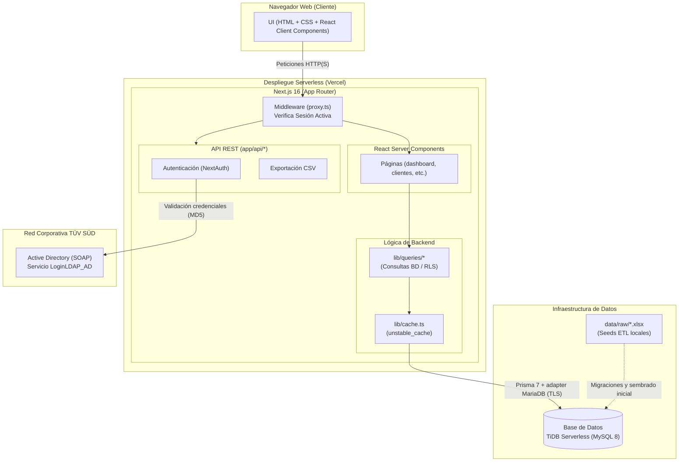

# Arquitectura

Focus es una aplicación web **full-stack** construida sobre Next.js 16 (App Router) con renderizado mayoritariamente en servidor (React Server Components). Toda la lógica de acceso a datos corre en el servidor; el navegador solo recibe HTML y componentes cliente puntuales.

## Stack tecnológico

| Capa | Tecnología | Notas |
|---|---|---|
| Framework | **Next.js 16.2.6** (App Router) | TypeScript strict. ⚠️ Versión con *breaking changes* respecto a Next anteriores (ver aviso abajo). |
| UI runtime | **React 19.2** | Server Components por defecto. |
| Estilos | **Tailwind CSS v4** + **`@tuvsud/design-system`** ("Algorithm") | Web components corporativos `ts-*` con wrappers React. Hay una skill `tuvsud-algorithm` para esto. |
| Gráficas / tablas | **recharts** · **TanStack Table** | |
| ORM | **Prisma 7.8** | Driver adapter **`@prisma/adapter-mariadb`** (no el conector nativo). |
| Base de datos | **MySQL 8** | `focus_dev` en local. |
| Autenticación | **next-auth v4** (JWT) | Login contra Active Directory por SOAP. Ver [Autenticación](/Autenticacion). |
| ETL / seeds | **tsx** + **xlsx** | Scripts TypeScript que leen los Excel de `data/raw/`. |

> ⚠️ **Next.js 16 no es el que conoces.** Tiene cambios de API y convenciones. Antes de escribir código, consulta las guías en `app/node_modules/next/dist/docs/` (ver `app/AGENTS.md`). Ejemplo concreto: el middleware, que en versiones previas era `middleware.ts`, aquí se llama **`proxy.ts`**.

## Vista por capas

## Estructura de carpetas clave (`app/`)

| Ruta | Qué contiene |
|---|---|
| `src/app/(dashboard)/` | Las pantallas: `dashboard`, `clientes`, `clientes/[id]`, `segmentacion`, `top-clientes`, `catalogo`, `accesos`, `auditoria`, `login`. |
| `src/app/api/` | Endpoints REST puros: `auth/[...nextauth]`, `clientes/export` y otros `*/export` (CSV), `revalidate`. |
| `src/lib/queries/` | **El backend.** Consultas a BD por feature (`customers.ts`, `dashboard.ts`, `segmentacion.ts`, `audit.ts`, `incompatibilities.ts`…). Aquí se aplicaría el RLS. |
| `src/lib/auth.ts` | Configuración de next-auth, `authorize()`, `loadUserScope`, eventos de auditoría de login. |
| `src/lib/ad-soap.ts` | Cliente SOAP de Active Directory (`LoginLDAP_AD`, `ExisteUsuarioLDAP_AD`). |
| `src/lib/prisma.ts` | Cliente Prisma + configuración del adapter MariaDB (TLS por entorno). |
| `src/lib/cache.ts` | Envoltura de caché de agregaciones de solo lectura. |
| `src/lib/audit.ts` · `audit-events.ts` | Logger de auditoría (seguro, nunca lanza) y catálogo de tipos de evento. |
| `src/proxy.ts` | Middleware de autenticación (Next 16). |
| `src/components/` | Componentes por feature: `buscador/`, `cliente/`, `segmentacion/`, `accesos/`, `auditoria/`, `layout/`, `ui/`. |
| `prisma/schema.prisma` | Esquema canónico (25 tablas). |
| `prisma/migrations/` | 10 migraciones. |
| `prisma/seeds/` | Seeds 01–18 + `lib/` (utilidades de ETL). |

## Renderizado y datos (React Server Components)

Las páginas son **Server Components**: se ejecutan en el servidor, llaman directamente a `lib/queries/` (que consultan MySQL vía Prisma) y devuelven HTML ya renderizado. Esto significa:

- No hay una "API REST" intermedia para la mayoría de las lecturas; la página *es* el backend.
- Los endpoints en `app/api/` se reservan para casos que necesitan ser invocables fuera del render: **export CSV**, **autenticación** y **revalidación de caché**.
- Para **depurar el backend**, se ponen breakpoints en `lib/queries/` y se usa la configuración *"Next.js: debug server-side"* del IDE (ver [Puesta en Marcha Local](/Puesta-en-Marcha-Local)).

## Caché de agregaciones

`src/lib/cache.ts` envuelve las agregaciones de solo lectura (facturación, KPIs) con `unstable_cache` de Next, bajo el tag **`billing`** y un TTL de **5 minutos**. Tras re-seedear datos, `POST /api/revalidate` invalida ese tag.

**Regla importante**: toda query cacheada que dependa del alcance del usuario (RLS) **debe** recibir `buIds`/`allowedFilters` como argumento, porque esos valores forman parte de la **clave de caché**. Si no, un usuario podría ver datos cacheados de otro alcance. (Hoy el RLS está desactivado y el alcance es global — ver [Autenticación](/Autenticacion) — pero la regla sigue vigente por si se reactiva.)

## Decisiones de arquitectura

El *por qué* de las elecciones (Next 16 + Prisma, descartar shadcn/Tremor, adapter MariaDB, RLS desactivado, etc.) está documentado en [Decisiones de Diseño](/Decisiones-de-Diseno).

> **Siguiente**: [Modelo de Datos](/Modelo-de-Datos) — las 25 tablas y cómo se relacionan.
