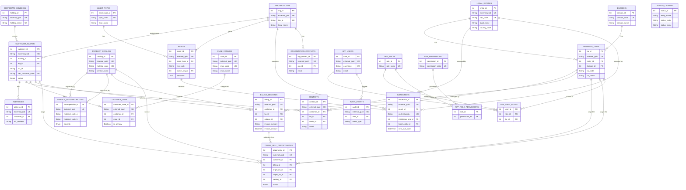

# Diagrama Entidad-Relación Completo (Focus v1)

Este diagrama modela las 25 tablas completas de la base de datos `focus_dev` tal y como están definidas en el archivo `schema.prisma`. 

```mermaid
erDiagram
    %% MÓDULO 0: ESTRUCTURA ORGANIZATIVA
    LEGAL_ENTITIES {
        Int entity_id PK
        String external_guid UK
        String sap_code UK
        String legal_name
        String country_code
    }
    DIVISIONS {
        Int division_id PK
        String division_code UK
        String division_name
    }
    BUSINESS_UNITS {
        Int bu_id PK
        String external_guid UK
        Int entity_id FK
        Int division_id FK
        String bu_code
        String bu_name
    }
    LEGAL_ENTITIES ||--o{ BUSINESS_UNITS : "has"
    DIVISIONS ||--o{ BUSINESS_UNITS : "has"

    %% MÓDULO 1: GOLDEN RECORD
    CORPORATE_HOLDINGS {
        Int holding_id PK
        String external_guid UK
        String holding_name UK
    }
    PRODUCT_CATALOG {
        Int catalog_id PK
        String external_guid UK
        String material_code UK
        String service_name
    }
    SERVICE_INCOMPATIBILITIES {
        Int incompatibility_id PK
        String external_guid UK
        String material_code_a
        String material_code_b
        Enum severity
    }
    PRODUCT_CATALOG ||--o{ SERVICE_INCOMPATIBILITIES : "logical ref (A)"
    PRODUCT_CATALOG ||--o{ SERVICE_INCOMPATIBILITIES : "logical ref (B)"

    ORGANIZATIONS {
        Int org_id PK
        String external_guid UK
        String tax_id UK
        String legal_name
    }
    CUSTOMER_MASTER {
        Int customer_id PK
        String external_guid UK
        Int holding_id FK
        Int org_id FK
        String tax_id
        String sap_customer_code UK
        Enum status
    }
    CORPORATE_HOLDINGS ||--o{ CUSTOMER_MASTER : "groups"
    ORGANIZATIONS ||--o{ CUSTOMER_MASTER : "deduplicates"

    ADDRESSES {
        Int address_id PK
        String external_guid UK
        Int customer_id FK
        String full_address
    }
    CUSTOMER_MASTER ||--o{ ADDRESSES : "has"

    CONTACTS {
        Int contact_id PK
        String external_guid UK
        Int customer_id FK
        Int bu_id FK
        Int entity_id FK
        String email
    }
    CUSTOMER_MASTER ||--o{ CONTACTS : "has"
    BUSINESS_UNITS ||--o{ CONTACTS : "managed by"
    LEGAL_ENTITIES ||--o{ CONTACTS : "managed by"

    %% MÓDULO 2: CLASIFICACIÓN SECTORIAL (CNAE)
    CNAE_CATALOG {
        Int cnae_id PK
        String external_guid UK
        String cnae_code UK
        String cnae_name
    }
    CUSTOMER_CNAE {
        Int customer_cnae_id PK
        String external_guid UK
        Int customer_id FK
        Int cnae_id FK
        Boolean is_primary
    }
    CUSTOMER_MASTER ||--o{ CUSTOMER_CNAE : "has"
    CNAE_CATALOG ||--o{ CUSTOMER_CNAE : "categorizes"

    %% MÓDULO 3: INTELIGENCIA COMERCIAL
    BILLING_RECORDS {
        Int billing_id PK
        String external_guid UK
        Int customer_id FK
        Int bu_id FK
        Int catalog_id FK
        String invoice_number
        Decimal invoice_amount
    }
    CUSTOMER_MASTER ||--o{ BILLING_RECORDS : "billed to"
    BUSINESS_UNITS ||--o{ BILLING_RECORDS : "billed by"
    PRODUCT_CATALOG ||--o{ BILLING_RECORDS : "service"

    CROSS_SELL_OPPORTUNITIES {
        Int opportunity_id PK
        String external_guid UK
        Int customer_id FK
        Int billing_id FK
        Int origin_bu_id FK
        Int target_bu_id FK
        Int catalog_id FK
        Enum status
    }
    CUSTOMER_MASTER ||--o{ CROSS_SELL_OPPORTUNITIES : "target"
    BILLING_RECORDS ||--o{ CROSS_SELL_OPPORTUNITIES : "originates from"
    BUSINESS_UNITS ||--o{ CROSS_SELL_OPPORTUNITIES : "origin BU"
    BUSINESS_UNITS ||--o{ CROSS_SELL_OPPORTUNITIES : "target BU"
    PRODUCT_CATALOG ||--o{ CROSS_SELL_OPPORTUNITIES : "service"

    %% MÓDULO 4: ACTIVOS INSPECCIONABLES
    ASSET_TYPES {
        Int asset_type_id PK
        String type_code UK
        String type_name
    }
    ASSETS {
        Int asset_id PK
        String external_guid UK
        Int asset_type_id FK
        String reg_code
        Int owner_org_id FK
        Json attributes
    }
    ASSET_TYPES ||--o{ ASSETS : "type"
    ORGANIZATIONS ||--o{ ASSETS : "owns"

    INSPECTIONS {
        Int inspection_id PK
        String external_guid UK
        Int asset_id FK
        String cod_industria UK
        Int maintainer_org_id FK
        Int legal_entity_id FK
        DateTime next_due_date
    }
    ASSETS ||--o{ INSPECTIONS : "receives"
    ORGANIZATIONS ||--o{ INSPECTIONS : "maintains"
    LEGAL_ENTITIES ||--o{ INSPECTIONS : "executed by"

    ORGANIZATION_CONTACTS {
        Int org_contact_id PK
        String external_guid UK
        Int org_id FK
        String email
    }
    ORGANIZATIONS ||--o{ ORGANIZATION_CONTACTS : "has"

    %% MÓDULO 6: REFERENCIA
    STATUS_CATALOG {
        Int status_id PK
        String entity_name
        String status_code
        String status_name
    }

    %% MÓDULO 5: CONTROL DE ACCESO (IAM) + AUDITORÍA
    APP_USERS {
        Int user_id PK
        String external_guid UK
        String username UK
        String email
    }
    APP_ROLES {
        Int role_id PK
        String role_name UK
    }
    APP_PERMISSIONS {
        Int permission_id PK
        String permission_code UK
    }
    APP_USER_ROLES {
        Int user_id FK
        Int role_id FK
        Int bu_id FK
    }
    APP_USERS ||--o{ APP_USER_ROLES : "assigned"
    APP_ROLES ||--o{ APP_USER_ROLES : "assigned"
    BUSINESS_UNITS ||--o{ APP_USER_ROLES : "scoped to"

    APP_ROLE_PERMISSIONS {
        Int role_id FK
        Int permission_id FK
    }
    APP_ROLES ||--o{ APP_ROLE_PERMISSIONS : "grants"
    APP_PERMISSIONS ||--o{ APP_ROLE_PERMISSIONS : "granted to"

    AUDIT_EVENTS {
        Int audit_id PK
        String external_guid UK
        Int user_id FK
        String event_type
    }
    APP_USERS ||--o{ AUDIT_EVENTS : "triggers"
```
