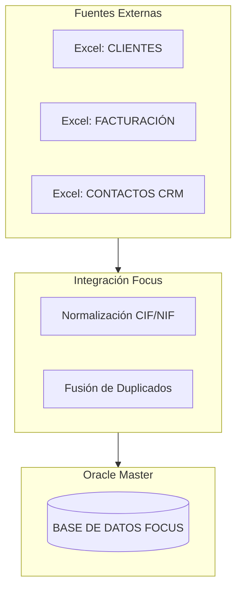
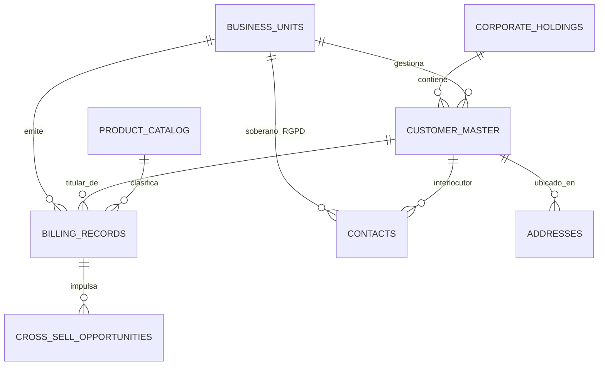
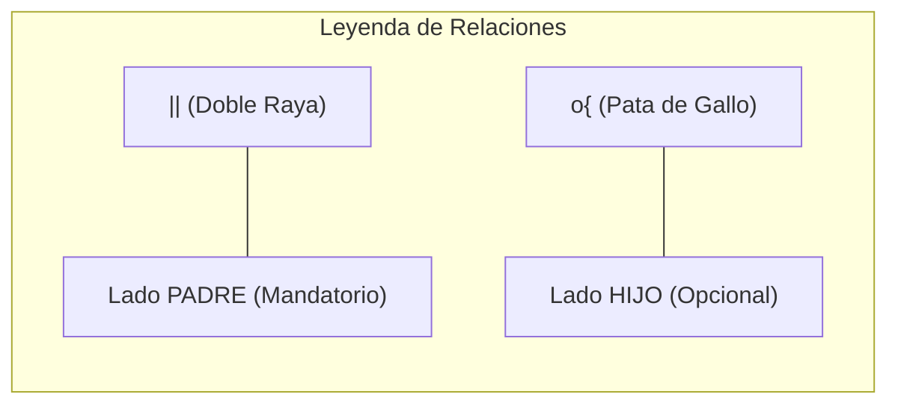

# Documentación Maestra
# Arquitectura de Datos "Proyecto Focus"

## 1. Visión Estratégica
El proyecto **Focus** agrupa la información de Clientes, Contactos y Facturación de TÜV LFD en un **Dato Maestro (Golden Record)** único. Esto permite una visión 360º del cliente para potenciar el Cross-Selling y asegurar el cumplimiento de privacidad.

---

## 2. Flujo Conceptual de Ingesta
Este diagrama muestra la secuencia lógica desde la recolección de archivos hasta el almacenamiento centralizado en Oracle.

---

## 3. Modelo de Datos Relacional (ERD)
Arquitectura jerárquica: Los **Padres** están arriba y los **Hijos** están debajo.

### 3.1 Guía de Simbología y Cardinalidad
Para facilitar la lectura del diagrama, utilice esta clave explicativa:

*   **PK (Primary Key)**: Matrícula única e irrepetible de cada fila en la tabla.
*   **FK (Foreign Key)**: Enlace técnico ("cable") que conecta una tabla Hija con su tabla Padre.

---

## 4. Diccionario de Datos: Master Sheets (8 de 8)

### 4.1 `CORPORATE_HOLDINGS`
*   **Rol en la Jerarquía:** **TABLA PADRE (NIVEL 1)**.
*   **Funcionalidad:** Agrupación corporativa superior (Grandes Cuentas / UTEs).

| Campo | Tipo | Explicación Funcional | Relación / Referencia |
| :--- | :--- | :--- | :--- |
| `holding_id` | NUMBER (PK) | ID interno (Secuencia Oracle). | - |
| `external_guid` | VARCHAR2(36) | ID externo para sistemas terceros. | Identidad Universal |
| `holding_name` | VARCHAR2(255) | Nombre del Gran Grupo / UTE. | - |
| `created_at` | TIMESTAMP | Fecha y hora de carga. | Auditoría |
| `source_system` | VARCHAR2(64) | Sistema origen del dato. | Auditoría |
| `etl_run_id` | NUMBER | ID del proceso técnico. | Auditoría |

### 4.2 `BUSINESS_UNITS`
*   **Rol en la Jerarquía:** **TABLA PADRE (NIVEL 1)**.
*   **Funcionalidad:** Sociedades legales de TÜV LFD (ITV, Industria, etc.).

| Campo | Tipo | Explicación Funcional | Relación / Referencia |
| :--- | :--- | :--- | :--- |
| `bu_id` | NUMBER (PK) | ID único interno (Secuencia Oracle). | - |
| `external_guid` | VARCHAR2(36) | ID externo para sistemas terceros. | Identidad Universal |
| `sap_code` | VARCHAR2(10) | Código SAP oficial (ej. 8888). | - |
| `bu_name` | VARCHAR2(100) | Nombre comercial de la BU. | - |
| `created_at` | TIMESTAMP | Fecha y hora de carga. | Auditoría |
| `source_system` | VARCHAR2(64) | Sistema origen del dato. | Auditoría |
| `etl_run_id` | NUMBER | ID del proceso técnico. | Auditoría |

### 4.3 `CUSTOMER_MASTER`
*   **Rol en la Jerarquía:** **HIJA** de Holdings | **PADRE** de contactos/facturación.
*   **Funcionalidad:** Punto único de verdad por cada CIF/NIF.

| Campo | Tipo | Explicación Funcional | Relación / Referencia |
| :--- | :--- | :--- | :--- |
| `customer_id` | NUMBER (PK) | ID interno único (Secuencia Oracle). | - |
| `external_guid` | VARCHAR2(36) | ID externo para sistemas terceros. | Identidad Universal |
| `holding_id` | NUMBER (FK) | Enlace al grupo superior. | Ref: `CORPORATE_HOLDINGS.holding_id` |
| `tax_id` | VARCHAR2(64) | CIF/NIF (Clave de identidad). | Único por cliente. |
| `legal_name` | VARCHAR2(255) | Nombre legal de la empresa. | - |
| `created_at` | TIMESTAMP | Fecha y hora de carga. | Auditoría |
| `source_system` | VARCHAR2(64) | Sistema origen del dato. | Auditoría |
| `etl_run_id` | NUMBER | ID del proceso técnico. | Auditoría |

### 4.4 `ADDRESSES`
*   **Rol en la Jerarquía:** **HIJA** de Customer Master.
*   **Funcionalidad:** Plantas industriales y sedes asociadas al cliente.

| Campo | Tipo | Explicación Funcional | Relación / Referencia |
| :--- | :--- | :--- | :--- |
| `address_id` | NUMBER (PK) | ID único interno (Secuencia Oracle). | - |
| `external_guid` | VARCHAR2(36) | ID externo para sistemas terceros. | Identidad Universal |
| `customer_id` | NUMBER (FK) | Cliente propietario de la sede. | Ref: `CUSTOMER_MASTER.customer_id` |
| `full_address` | VARCHAR2(255) | Dirección técnica completa. | - |
| `created_at` | TIMESTAMP | Fecha y hora de carga. | Auditoría |
| `source_system` | VARCHAR2(64) | Sistema origen del dato. | Auditoría |
| `etl_run_id` | NUMBER | ID del proceso técnico. | Auditoría |

### 4.5 `CONTACTS`
*   **Rol en la Jerarquía:** **HIJA** de Customer Master y Business Units.
*   **Funcionalidad:** Interlocutores físicos bajo protección RGPD.

| Campo | Tipo | Explicación Funcional | Relación / Referencia |
| :--- | :--- | :--- | :--- |
| `contact_id` | NUMBER (PK) | ID único interno (Secuencia Oracle). | - |
| `external_guid` | VARCHAR2(36) | ID externo para sistemas terceros. | Identidad Universal |
| `customer_id` | NUMBER (FK) | Empresa para la que trabaja. | Ref: `CUSTOMER_MASTER.customer_id` |
| `owning_bu_id` | NUMBER (FK) | BU responsable de la privacidad. | Ref: `BUSINESS_UNITS.bu_id` |
| `full_name` | VARCHAR2(255) | Nombre y apellidos. | - |
| `created_at` | TIMESTAMP | Fecha y hora de carga. | Auditoría |
| `source_system` | VARCHAR2(64) | Sistema origen del dato. | Auditoría |
| `etl_run_id` | NUMBER | ID del proceso técnico. | Auditoría |

### 4.6 `BILLING_RECORDS`
*   **Rol en la Jerarquía:** **HIJA** de Customer, BU y Catálogo.
*   **Funcionalidad:** Histórico de servicios con fechas de caducidad.

| Campo | Tipo | Explicación Funcional | Relación / Referencia |
| :--- | :--- | :--- | :--- |
| `billing_id` | NUMBER (PK) | ID único interno (Secuencia Oracle). | - |
| `external_guid` | VARCHAR2(36) | ID externo para sistemas terceros. | Identidad Universal |
| `customer_id` | NUMBER (FK) | Cliente titular del servicio. | Ref: `CUSTOMER_MASTER.customer_id` |
| `bu_id` | NUMBER (FK) | Unidad que facturó el trabajo. | Ref: `BUSINESS_UNITS.bu_id` |
| `catalog_id` | NUMBER (FK) | Vínculo con el catálogo técnico. | Ref: `PRODUCT_CATALOG.catalog_id` |
| `expiry_date` | DATE | Fecha fin de servicio (Alarma). | Base para Cross-Selling |
| `created_at` | TIMESTAMP | Fecha y hora de carga. | Auditoría |
| `source_system` | VARCHAR2(64) | Sistema origen del dato. | Auditoría |
| `etl_run_id` | NUMBER | ID del proceso técnico. | Auditoría |

### 4.7 `PRODUCT_CATALOG`
*   **Rol en la Jerarquía:** **TABLA PADRE** para facturación.
*   **Funcionalidad:** Normalización de servicios de TÜV LFD.

| Campo | Tipo | Explicación Funcional | Relación / Referencia |
| :--- | :--- | :--- | :--- |
| `catalog_id` | NUMBER (PK) | ID único interno (Secuencia Oracle). | - |
| `external_guid` | VARCHAR2(36) | ID externo para sistemas terceros. | Identidad Universal |
| `material_code` | VARCHAR2(64) | Código identificador único SAP. | Único |
| `description` | VARCHAR2(255) | Nombre comercial del servicio. | - |
| `category` | VARCHAR2(100) | Familia técnica (ej. Elevación). | - |
| `created_at` | TIMESTAMP | Fecha y hora de carga. | Auditoría |
| `source_system` | VARCHAR2(64) | Sistema origen del dato. | Auditoría |
| `etl_run_id` | NUMBER | ID del proceso técnico. | Auditoría |

### 4.8 `CROSS_SELL_OPPORTUNITIES`
*   **Rol en la Jerarquía:** **HIJA** de Billing y Catalog.
*   **Funcionalidad:** Alertas de venta proactivas generadas por el sistema.

| Campo | Tipo | Explicación Funcional | Relación / Referencia |
| :--- | :--- | :--- | :--- |
| `opportunity_id` | NUMBER (PK) | ID único interno (Secuencia Oracle). | - |
| `external_guid` | VARCHAR2(36) | ID externo para sistemas terceros. | Identidad Universal |
| `billing_id` | NUMBER (FK) | Factura origen del aviso. | Ref: `BILLING_RECORDS.billing_id` |
| `suggested_cat_id`| NUMBER (FK) | Servicio técnico recomendado. | Ref: `PRODUCT_CATALOG.catalog_id` |
| `status` | VARCHAR2(32) | Estado (NEW, IN_PROGRESS). | - |
| `created_at` | TIMESTAMP | Fecha y hora de carga. | Auditoría |
| `source_system` | VARCHAR2(64) | Sistema origen del dato. | Auditoría |
| `etl_run_id` | NUMBER | ID del proceso técnico. | Auditoría |

---

## 5. Auditoría y Trazabilidad

### 5.1 Estrategia de Identificación Dual
Para garantizar la integridad y la portabilidad del sistema, todas las tablas implementan dos tipos de identificadores:

1.  **Identificadores Internos (PK)**: Gestionados mediante **Oracle Sequences**. Son números incrementales óptimos para el rendimiento de las consultas y las claves foráneas dentro de la propia base de datos.
2.  **Identificadores Universales (GUID)**: Almacenados en el campo `external_guid`. Son UUIDs únicos que permiten la conexión segura con sistemas externos (CRMs, APIs, Aplicaciones Móviles) sin exponer las claves internas del sistema.

### 5.2 Campos de Auditoría
Adicionalmente, cada tabla incluye campos técnicos para reconstruir el origen de cualquier dato:

*   **`created_at`**: Registro del momento exacto de inserción.
*   **`source_system`**: Fuente original (ej. Excel CRM sociedad X).
*   **`etl_run_id`**: Vínculo con la ejecución técnica específica de carga.
