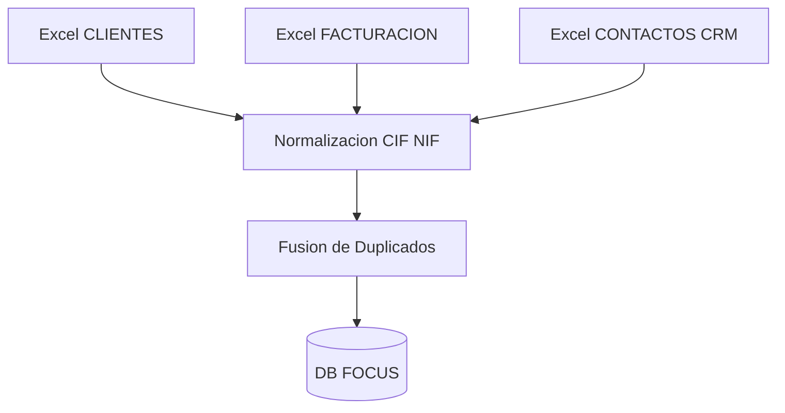
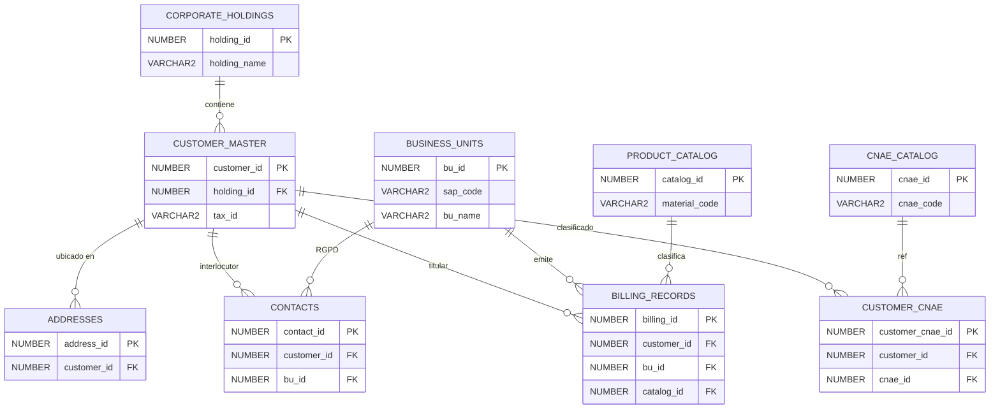
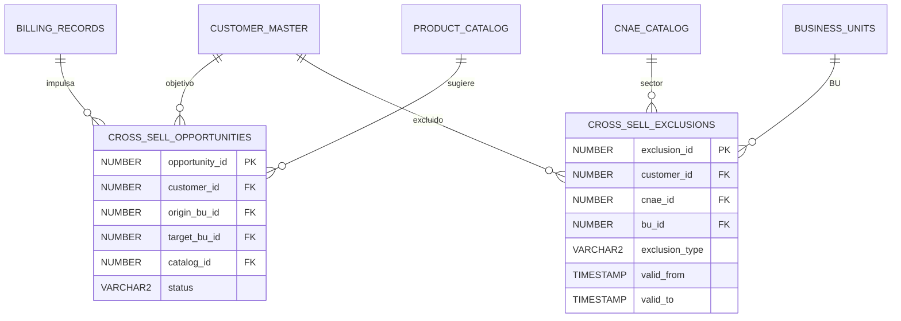
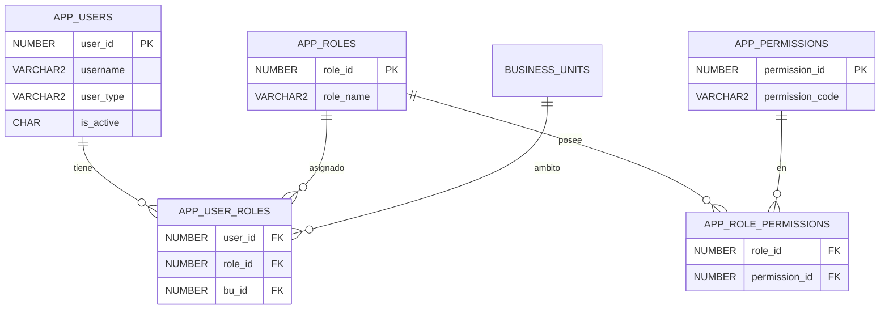
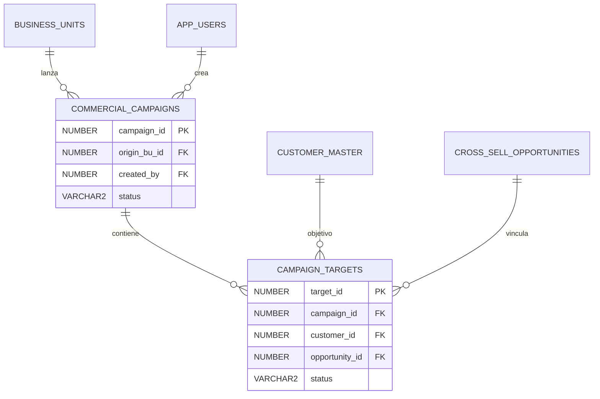
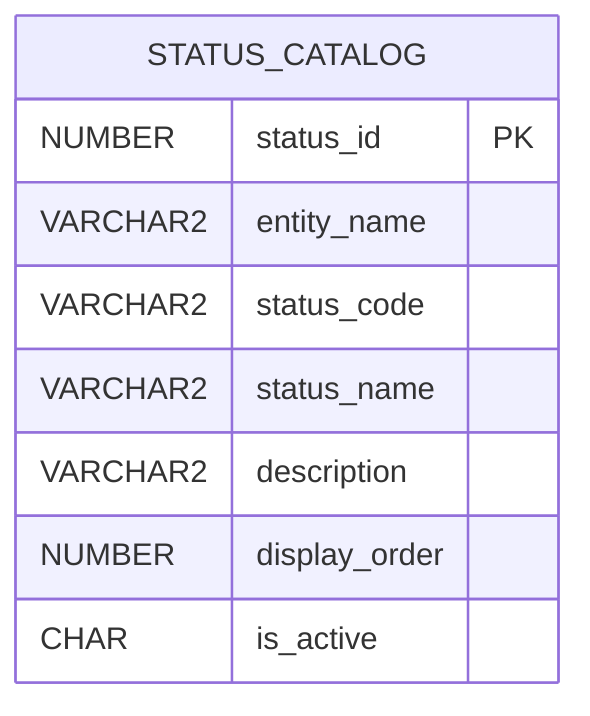
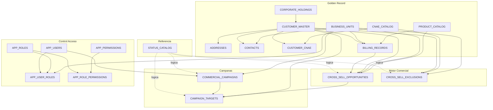
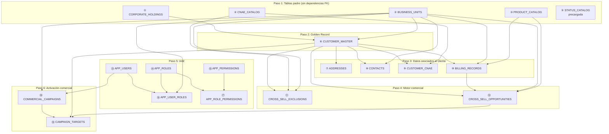
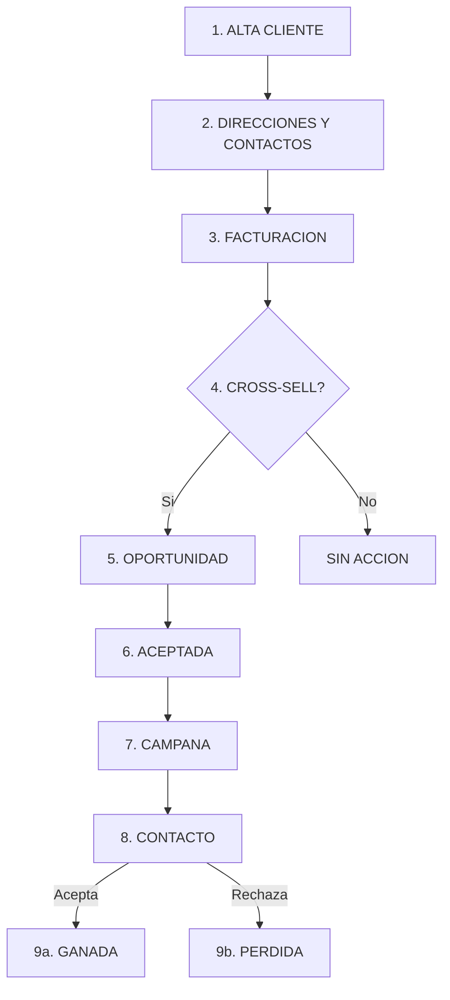
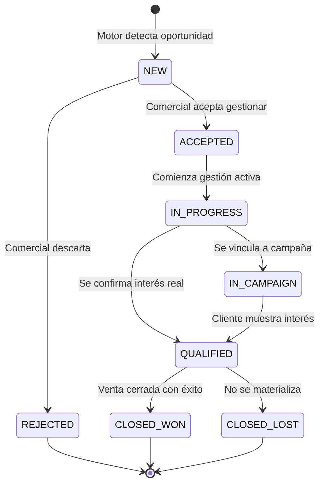

# Proyecto Focus — Documentación Técnica del Modelo de Datos

**TÜV LFD España** · Equipo de Desarrollo · Versión 2.1 (Abril 2026)

> ⚠️ **Nota de vigencia (10-06-2026).** Este documento es el **diseño original** del modelo (abril 2026) y se conserva como referencia del diccionario de datos y los ERD. El esquema canónico vive en [`app/prisma/schema.prisma`](../../app/prisma/schema.prisma) y diverge en estos puntos:
>
> - El modelo real tiene **23 tablas**, no 19: se añadieron `LEGAL_ENTITIES`, `DIVISIONS` (estructura organizativa real) y el módulo de **activos inspeccionables** (`ORGANIZATIONS`, `ASSET_TYPES`, `ASSETS`, `INSPECTIONS`, `ORGANIZATION_CONTACTS`), no descrito aquí.
> - `CROSS_SELL_EXCLUSIONS`, `COMMERCIAL_CAMPAIGNS` y `CAMPAIGN_TARGETS` **no existen** todavía (pospuestas a v2); sus secciones y FKs en este documento son diseño, no estado actual.
> - El **motor automático de cross-sell está desactivado**: `CROSS_SELL_OPPORTUNITIES` existe pero vacía; el análisis de whitespots es manual desde el Buscador 360.
> - **Identidad de cliente**: desde el refactor del 28-05-2026, la identidad fuerte de `CUSTOMER_MASTER` es `sap_customer_code` (único); `tax_id` es atributo nullable. El golden record por CIF es la tabla `ORGANIZATIONS`. Ver [REFACTOR_CUSTOMER_IDENTITY.md](../data-cleanup/REFACTOR_CUSTOMER_IDENTITY.md).
> - El módulo IAM **sí está implementado** (con `allowed_filters` JSON por usuario, no contemplado aquí), y `STATUS_CATALOG` precarga **23 estados** (se añadieron 4 de CUSTOMER).
> - No hay secuencias ni triggers Oracle: PKs autoincrementales y UUIDs generados por la aplicación (Prisma + MySQL 8).

---

## Índice

1. [Visión General](#1-visión-general)
2. [Flujo de Ingesta](#2-flujo-de-ingesta)
3. [Diagramas del Modelo (ERD)](#3-diagramas-del-modelo-erd)
4. [Diccionario de Datos](#4-diccionario-de-datos)
5. [Auditoría y Trazabilidad](#5-auditoría-y-trazabilidad)
6. [Resumen del Modelo](#6-resumen-del-modelo)
7. [Guía de Despliegue y Mantenimiento](#7-guía-de-despliegue-y-mantenimiento)
- Anexo A — Acceso a la Aplicación
- Anexo B — Flujo de Inserción de un Registro Completo
- Anexo C — Flujo Funcional de un Registro (Ciclo de Vida Completo)

---

## 1. Visión General

El proyecto Focus agrupa la información de Clientes, Contactos y Facturación de TÜV LFD en un Dato Maestro (Golden Record) único. La versión ampliada incorpora tres módulos adicionales: Exclusiones Comerciales, Control de Acceso (IAM) y Gestión de Campañas.

**Dimensión del modelo**: 19 tablas · 17 secuencias · 19 estados precargados · Script idempotente.

## 2. Flujo de Ingesta



## 3. Diagramas del Modelo (ERD)

### 3.1 Módulo 1 — Golden Record

Este módulo define la identidad del cliente, sus relaciones con la estructura organizativa, su clasificación sectorial y su histórico de facturación.

**Relaciones:**

| Padre              | Hijo            | FK          | Card.    | Descripción             |
| :----------------- | :-------------- | :---------- | :------- | :---------------------- |
| CORPORATE_HOLDINGS | CUSTOMER_MASTER | holding_id  | 1:N opc. | Holding agrupa clientes |
| CUSTOMER_MASTER    | ADDRESSES       | customer_id | 1:N      | Direcciones del cliente |
| CUSTOMER_MASTER    | CONTACTS        | customer_id | 1:N      | Contactos del cliente   |
| BUSINESS_UNITS     | CONTACTS        | bu_id       | 1:N      | BU soberana RGPD        |
| CUSTOMER_MASTER    | BILLING_RECORDS | customer_id | 1:N      | Facturas del cliente    |
| BUSINESS_UNITS     | BILLING_RECORDS | bu_id       | 1:N      | BU que emite factura    |
| PRODUCT_CATALOG    | BILLING_RECORDS | catalog_id  | 1:N      | Servicio facturado      |
| CNAE_CATALOG       | CUSTOMER_CNAE   | cnae_id     | 1:N      | CNAE asignado           |
| CUSTOMER_MASTER    | CUSTOMER_CNAE   | customer_id | 1:N      | CNAEs del cliente       |



---

### 3.2 Módulo 2 — Oportunidades y Exclusiones

Oportunidades de venta cruzada generadas automáticamente y reglas de exclusión que protegen clientes o sectores.

**Relaciones CROSS_SELL_OPPORTUNITIES:**

| Padre | FK | Card. | Descripción |
|:---|:---|:---|:---|
| CUSTOMER_MASTER | customer_id | 1:N | Cliente objetivo |
| BILLING_RECORDS | billing_id | 1:N opc. | Factura que origina la alerta |
| BUSINESS_UNITS | origin_bu_id | 1:N | BU donde está el cliente |
| BUSINESS_UNITS | target_bu_id | 1:N | BU objetivo de la propuesta |
| PRODUCT_CATALOG | catalog_id | 1:N | Servicio sugerido |

> **origin_bu_id** y **target_bu_id** referencian ambos a `BUSINESS_UNITS.bu_id` pero con funciones distintas: el primero indica de dónde viene el cliente y el segundo hacia dónde va la propuesta.

**Relaciones CROSS_SELL_EXCLUSIONS:**

| Padre | FK | Card. | Descripción |
|:---|:---|:---|:---|
| CUSTOMER_MASTER | customer_id | 1:N opc. | Excluye un cliente |
| CNAE_CATALOG | cnae_id | 1:N opc. | Excluye un sector |
| BUSINESS_UNITS | bu_id | 1:N opc. | Excluye una BU |

Las tres FK son opcionales e independientes. Se combinan o usan por separado.



---

### 3.3 Módulo 3 — Control de Acceso (IAM)

Gestiona quién accede a la aplicación, con qué perfil y sobre qué BU. Autenticación dual AD y Local.

**Relaciones:**

| Padre | Hijo | FK | Card. | Descripción |
|:---|:---|:---|:---|:---|
| APP_USERS | APP_USER_ROLES | user_id | 1:N | Roles del usuario |
| APP_ROLES | APP_USER_ROLES | role_id | 1:N | Usuarios del rol |
| BUSINESS_UNITS | APP_USER_ROLES | bu_id | 1:N | Ámbito del rol |
| APP_ROLES | APP_ROLE_PERMISSIONS | role_id | 1:N | Permisos del rol |
| APP_PERMISSIONS | APP_ROLE_PERMISSIONS | permission_id | 1:N | Roles del permiso |



---

### 3.4 Módulo 4 — Campañas Comerciales

Convierte oportunidades en acciones comerciales con trazabilidad y prevención de duplicados.

**Relaciones:**

| Padre | Hijo | FK | Card. | Descripción |
|:---|:---|:---|:---|:---|
| BUSINESS_UNITS | COMMERCIAL_CAMPAIGNS | origin_bu_id | 1:N | BU propietaria |
| APP_USERS | COMMERCIAL_CAMPAIGNS | created_by | 1:N | Usuario creador |
| COMMERCIAL_CAMPAIGNS | CAMPAIGN_TARGETS | campaign_id | 1:N | Clientes de la campaña |
| CUSTOMER_MASTER | CAMPAIGN_TARGETS | customer_id | 1:N | Cliente objetivo |
| CROSS_SELL_OPPORTUNITIES | CAMPAIGN_TARGETS | opportunity_id | 1:N opc. | Oportunidad origen |

> Restricción UNIQUE(campaign_id, customer_id) impide duplicar clientes en la misma campaña.



---

### 3.5 Módulo 5 — Catálogo de Estados

Tabla maestra que centraliza todos los estados y tipos válidos del sistema. Los campos `status` de las tablas operativas mantienen CHECK constraints para la integridad a nivel de base de datos, mientras que STATUS_CATALOG sirve como fuente de referencia para la capa de aplicación (desplegables, informes, traducciones).

> **Nota de diseño**: STATUS_CATALOG mantiene una **relación lógica** (no física) con las tablas operativas. No existen Foreign Keys desde las tablas operativas hacia STATUS_CATALOG. Los valores válidos de `status` se validan mediante `CHECK` constraints hardcodeados en cada tabla. Esta decisión es intencionada: los estados son estables y conocidos de antemano, la validación por `CHECK` es más eficiente, y evita JOINs innecesarios o columnas redundantes. STATUS_CATALOG existe para que la capa de aplicación pueda generar desplegables, nombres legibles y traducciones sin necesidad de hardcodear valores en el frontend. La correspondencia lógica se establece mediante el campo `entity_name` (que identifica la tabla: OPPORTUNITY, CAMPAIGN, TARGET, EXCLUSION) y el campo `status_code` (que coincide con los valores permitidos en los `CHECK` constraints de cada tabla).



**Correspondencia lógica con tablas operativas:**

| entity_name | Tabla operativa | Campo | Valores CHECK |
|:---|:---|:---|:---|
| OPPORTUNITY | CROSS_SELL_OPPORTUNITIES | status | NEW, ACCEPTED, IN_PROGRESS, IN_CAMPAIGN, QUALIFIED, REJECTED, CLOSED_WON, CLOSED_LOST |
| CAMPAIGN | COMMERCIAL_CAMPAIGNS | status | DRAFT, ACTIVE, COMPLETED, CANCELLED |
| TARGET | CAMPAIGN_TARGETS | status | PENDING, CONTACTED, CONVERTED, REJECTED |
| EXCLUSION | CROSS_SELL_EXCLUSIONS | exclusion_type | PERMANENT, TEMPORARY, MARKETING_ONLY |

La tabla se precarga con los 18 estados iniciales del sistema (ver detalle en sección 4.19).

---

### 3.6 Vista Panorámica

Las flechas continuas van de padres a hijos (FK físicas). Las flechas discontinuas representan relaciones lógicas (sin FK). `BUSINESS_UNITS` es la tabla más conectada.



**Simbología**: PK = Clave Primaria · FK = Clave Foránea · UK = Clave Única · `||` = lado padre (1) · `o{` = lado hijo (N) · `-.->` = relación lógica (sin FK física)

---

### 3.7 Matriz Maestra de Relaciones (27 Foreign Keys)

Cada tabla de la columna **Tabla Origen** contiene un campo FK que apunta a la **Tabla Destino**. La columna **Obl.** indica si el campo es obligatorio (SÍ = NOT NULL) u opcional (NO = puede ser NULL).

**Golden Record y Clasificación (9 FKs)**

| # | Tabla Origen | Campo FK | Tabla Destino | Obl. | Nota |
|:---:|:---|:---|:---|:---:|:---|
| 1 | CUSTOMER_MASTER | holding_id | CORPORATE_HOLDINGS | NO | Cliente en un holding |
| 2 | ADDRESSES | customer_id | CUSTOMER_MASTER | SÍ | Dirección del cliente |
| 3 | CONTACTS | customer_id | CUSTOMER_MASTER | SÍ | Contacto del cliente |
| 4 | CONTACTS | bu_id | BUSINESS_UNITS | SÍ | BU soberana (RGPD) |
| 5 | CUSTOMER_CNAE | customer_id | CUSTOMER_MASTER | SÍ | Relación N:M cliente |
| 6 | CUSTOMER_CNAE | cnae_id | CNAE_CATALOG | SÍ | Relación N:M sector |
| 7 | BILLING_RECORDS | customer_id | CUSTOMER_MASTER | SÍ | Titular de factura |
| 8 | BILLING_RECORDS | bu_id | BUSINESS_UNITS | SÍ | BU que factura |
| 9 | BILLING_RECORDS | catalog_id | PRODUCT_CATALOG | SÍ | Servicio facturado |

**Motor Comercial y Exclusiones (8 FKs)**

| # | Tabla Origen | Campo FK | Tabla Destino | Obl. | Nota |
|:---:|:---|:---|:---|:---:|:---|
| 10 | CROSS_SELL_OPP | customer_id | CUSTOMER_MASTER | SÍ | Cliente objetivo |
| 11 | CROSS_SELL_OPP | billing_id | BILLING_RECORDS | NO | Factura origen |
| 12 | CROSS_SELL_OPP | origin_bu_id | BUSINESS_UNITS | SÍ | BU que detecta |
| 13 | CROSS_SELL_OPP | target_bu_id | BUSINESS_UNITS | SÍ | BU destino |
| 14 | CROSS_SELL_OPP | catalog_id | PRODUCT_CATALOG | SÍ | Servicio sugerido |
| 15 | CROSS_SELL_EXCL | customer_id | CUSTOMER_MASTER | NO | Bloqueo cliente |
| 16 | CROSS_SELL_EXCL | cnae_id | CNAE_CATALOG | NO | Bloqueo sector |
| 17 | CROSS_SELL_EXCL | bu_id | BUSINESS_UNITS | NO | Bloqueo BU |

**IAM (5 FKs)**

| # | Tabla Origen | Campo FK | Tabla Destino | Obl. | Nota |
|:---:|:---|:---|:---|:---:|:---|
| 18 | APP_USER_ROLES | user_id | APP_USERS | SÍ | Usuario asignado |
| 19 | APP_USER_ROLES | role_id | APP_ROLES | SÍ | Rol asignado |
| 20 | APP_USER_ROLES | bu_id | BUSINESS_UNITS | SÍ | Ámbito del rol |
| 21 | APP_ROLE_PERMS | role_id | APP_ROLES | SÍ | Rol con permiso |
| 22 | APP_ROLE_PERMS | permission_id | APP_PERMISSIONS | SÍ | Permiso asignado |

**Campañas (5 FKs)**

| # | Tabla Origen | Campo FK | Tabla Destino | Obl. | Nota |
|:---:|:---|:---|:---|:---:|:---|
| 23 | COMMERCIAL_CAMP | origin_bu_id | BUSINESS_UNITS | SÍ | BU lanzadora |
| 24 | COMMERCIAL_CAMP | created_by | APP_USERS | SÍ | Usuario creador |
| 25 | CAMPAIGN_TARGETS | campaign_id | COMMERCIAL_CAMP | SÍ | Campaña asignada |
| 26 | CAMPAIGN_TARGETS | customer_id | CUSTOMER_MASTER | SÍ | Cliente objetivo |
| 27 | CAMPAIGN_TARGETS | opportunity_id | CROSS_SELL_OPP | NO | Oportunidad origen |

> **Relaciones N:M**: FKs 5-6 = Cliente/CNAE · FKs 18-20 = Usuario/Rol/BU · FKs 21-22 = Rol/Permiso.

---

## 4. Diccionario de Datos

Cada tabla se documenta con: descripción funcional, dependencias, y la tabla completa de campos con tipo Oracle, nulidad, restricciones y referencia FK.

---

**4.1 CORPORATE_HOLDINGS** — Agrupaciones corporativas (Holdings, Grandes Cuentas, UTEs). Tabla padre nivel 1. Un holding agrupa varios clientes bajo una misma estructura empresarial; la relación es opcional. **Hijas**: CUSTOMER_MASTER.

| Campo | Tipo | Nulo | Restricción | Ref. FK |
|:---|:---|:---|:---|:---|
| holding_id | NUMBER(10) | NO | PK, seq auto | — |
| external_guid | VARCHAR2(36) | NO | UK, CHECK UUID | — |
| holding_name | VARCHAR2(255) | NO | UK | — |
| created_at | TIMESTAMP | NO | DEFAULT SYSTIMESTAMP | — |
| source_system | VARCHAR2(64) | NO | — | — |
| etl_run_id | NUMBER(20) | NO | — | — |

---

**4.2 BUSINESS_UNITS** — Sociedades legales de TÜV LFD (ITV, Industria, etc.). Tabla padre nivel 1 y la más referenciada del modelo. Define quién emite facturas, quién es responsable RGPD, desde dónde se lanzan campañas y sobre qué ámbito opera cada usuario. **Hijas**: CONTACTS, BILLING_RECORDS, CROSS_SELL_OPPORTUNITIES (x2), CROSS_SELL_EXCLUSIONS, APP_USER_ROLES, COMMERCIAL_CAMPAIGNS.

| Campo | Tipo | Nulo | Restricción | Ref. FK |
|:---|:---|:---|:---|:---|
| bu_id | NUMBER(10) | NO | PK, seq auto | — |
| external_guid | VARCHAR2(36) | NO | UK, CHECK UUID | — |
| sap_code | VARCHAR2(10) | NO | UK | — |
| bu_name | VARCHAR2(100) | NO | UK | — |
| created_at | TIMESTAMP | NO | DEFAULT SYSTIMESTAMP | — |
| source_system | VARCHAR2(64) | NO | — | — |
| etl_run_id | NUMBER(20) | NO | — | — |

---

**4.3 PRODUCT_CATALOG** — Catálogo corporativo de servicios y productos, identificados por código SAP. **Hijas**: BILLING_RECORDS, CROSS_SELL_OPPORTUNITIES.

| Campo | Tipo | Nulo | Restricción | Ref. FK |
|:---|:---|:---|:---|:---|
| catalog_id | NUMBER(10) | NO | PK, seq auto | — |
| external_guid | VARCHAR2(36) | NO | UK, CHECK UUID | — |
| material_code | VARCHAR2(64) | NO | UK | — |
| description | VARCHAR2(255) | NO | — | — |
| category | VARCHAR2(100) | SÍ | — | — |
| created_at | TIMESTAMP | NO | DEFAULT SYSTIMESTAMP | — |
| source_system | VARCHAR2(64) | NO | — | — |
| etl_run_id | NUMBER(20) | NO | — | — |

---

**4.4 CUSTOMER_MASTER** — Golden Record del sistema. Cada registro es un cliente único por CIF/NIF. Hija de CORPORATE_HOLDINGS. Padre de casi todo el modelo. La deduplicación se realiza en el proceso ETL. **Hijas**: ADDRESSES, CONTACTS, BILLING_RECORDS, CUSTOMER_CNAE, CROSS_SELL_OPPORTUNITIES, CROSS_SELL_EXCLUSIONS, CAMPAIGN_TARGETS.

| Campo | Tipo | Nulo | Restricción | Ref. FK |
|:---|:---|:---|:---|:---|
| customer_id | NUMBER(10) | NO | PK, seq auto | — |
| external_guid | VARCHAR2(36) | NO | UK, CHECK UUID | — |
| holding_id | NUMBER(10) | SÍ | FK | CORPORATE_HOLDINGS.holding_id |
| tax_id | VARCHAR2(64) | NO | UK | — |
| legal_name | VARCHAR2(255) | NO | — | — |
| created_at | TIMESTAMP | NO | DEFAULT SYSTIMESTAMP | — |
| source_system | VARCHAR2(64) | NO | — | — |
| etl_run_id | NUMBER(20) | NO | — | — |

---

**4.5 ADDRESSES** — Ubicaciones operativas del cliente (plantas, sedes, centros). Hija de CUSTOMER_MASTER. Clave para segmentación geográfica.

| Campo | Tipo | Nulo | Restricción | Ref. FK |
|:---|:---|:---|:---|:---|
| address_id | NUMBER(10) | NO | PK, seq auto | — |
| external_guid | VARCHAR2(36) | NO | UK, CHECK UUID | — |
| customer_id | NUMBER(10) | NO | FK | CUSTOMER_MASTER.customer_id |
| full_address | VARCHAR2(255) | NO | — | — |
| created_at | TIMESTAMP | NO | DEFAULT SYSTIMESTAMP | — |
| source_system | VARCHAR2(64) | NO | — | — |
| etl_run_id | NUMBER(20) | NO | — | — |

---

**4.6 CONTACTS** — Personas físicas de contacto del cliente bajo protección RGPD. Hija de CUSTOMER_MASTER y BUSINESS_UNITS. Solo la BU soberana puede autorizar el uso del contacto en acciones comerciales.

| Campo | Tipo | Nulo | Restricción | Ref. FK |
|:---|:---|:---|:---|:---|
| contact_id | NUMBER(10) | NO | PK, seq auto | — |
| external_guid | VARCHAR2(36) | NO | UK, CHECK UUID | — |
| customer_id | NUMBER(10) | NO | FK | CUSTOMER_MASTER.customer_id |
| bu_id | NUMBER(10) | NO | FK | BUSINESS_UNITS.bu_id |
| full_name | VARCHAR2(255) | NO | — | — |
| created_at | TIMESTAMP | NO | DEFAULT SYSTIMESTAMP | — |
| source_system | VARCHAR2(64) | NO | — | — |
| etl_run_id | NUMBER(20) | NO | — | — |

---

**4.7 CNAE_CATALOG** — Clasificación Nacional de Actividades Económicas. Tabla padre para segmentación sectorial. **Hijas**: CUSTOMER_CNAE, CROSS_SELL_EXCLUSIONS.

| Campo | Tipo | Nulo | Restricción | Ref. FK |
|:---|:---|:---|:---|:---|
| cnae_id | NUMBER(10) | NO | PK, seq auto | — |
| external_guid | VARCHAR2(36) | NO | UK, CHECK UUID | — |
| cnae_code | VARCHAR2(10) | NO | UK | — |
| cnae_name | VARCHAR2(255) | NO | — | — |
| cnae_level | VARCHAR2(32) | SÍ | — | — |
| created_at | TIMESTAMP | NO | DEFAULT SYSTIMESTAMP | — |
| source_system | VARCHAR2(64) | NO | — | — |
| etl_run_id | NUMBER(20) | NO | — | — |

---

**4.8 CUSTOMER_CNAE** — Tabla relación N:M entre CUSTOMER_MASTER y CNAE_CATALOG. Un cliente puede tener un CNAE principal (`is_primary=Y`) y varios secundarios. UK(customer_id, cnae_id) impide duplicar asignaciones.

| Campo | Tipo | Nulo | Restricción | Ref. FK |
|:---|:---|:---|:---|:---|
| customer_cnae_id | NUMBER(10) | NO | PK, seq auto | — |
| external_guid | VARCHAR2(36) | NO | UK, CHECK UUID | — |
| customer_id | NUMBER(10) | NO | FK, UK compuesta | CUSTOMER_MASTER.customer_id |
| cnae_id | NUMBER(10) | NO | FK, UK compuesta | CNAE_CATALOG.cnae_id |
| is_primary | CHAR(1) | NO | DEFAULT N, CHECK Y/N | — |
| created_at | TIMESTAMP | NO | DEFAULT SYSTIMESTAMP | — |
| source_system | VARCHAR2(64) | NO | — | — |
| etl_run_id | NUMBER(20) | NO | — | — |

---

**4.9 BILLING_RECORDS** — Histórico de facturación y actividad comercial. Hija de CUSTOMER_MASTER, BUSINESS_UNITS y PRODUCT_CATALOG. Fuente principal para detección de oportunidades: `expiry_date` y `service_end_date` identifican servicios próximos a caducar. **Hija**: CROSS_SELL_OPPORTUNITIES.

| Campo | Tipo | Nulo | Restricción | Ref. FK |
|:---|:---|:---|:---|:---|
| billing_id | NUMBER(10) | NO | PK, seq auto | — |
| external_guid | VARCHAR2(36) | NO | UK, CHECK UUID | — |
| customer_id | NUMBER(10) | NO | FK | CUSTOMER_MASTER.customer_id |
| bu_id | NUMBER(10) | NO | FK | BUSINESS_UNITS.bu_id |
| catalog_id | NUMBER(10) | NO | FK | PRODUCT_CATALOG.catalog_id |
| invoice_number | VARCHAR2(64) | SÍ | — | — |
| invoice_amount | NUMBER(18,2) | SÍ | CHECK >= 0 | — |
| invoice_date | DATE | SÍ | — | — |
| invoice_description | VARCHAR2(500) | SÍ | — | — |
| currency_code | VARCHAR2(3) | SÍ | CHECK ISO 3 | — |
| expiry_date | DATE | SÍ | — | — |
| service_start_date | DATE | SÍ | — | — |
| service_end_date | DATE | SÍ | — | — |
| created_at | TIMESTAMP | NO | DEFAULT SYSTIMESTAMP | — |
| source_system | VARCHAR2(64) | NO | — | — |
| etl_run_id | NUMBER(20) | NO | — | — |

---

**4.10 CROSS_SELL_OPPORTUNITIES** — Alertas de venta cruzada del motor comercial. Hija de CUSTOMER_MASTER, BILLING_RECORDS, BUSINESS_UNITS (x2) y PRODUCT_CATALOG. Padre de CAMPAIGN_TARGETS. Traza quién genera la alerta (origin_bu_id), a quién se dirige (target_bu_id) y qué servicio sugiere (catalog_id). Los estados se gestionan según STATUS_CATALOG (entity_name = OPPORTUNITY).

| Campo | Tipo | Nulo | Restricción | Ref. FK |
|:---|:---|:---|:---|:---|
| opportunity_id | NUMBER(10) | NO | PK, seq auto | — |
| external_guid | VARCHAR2(36) | NO | UK, CHECK UUID | — |
| customer_id | NUMBER(10) | NO | FK | CUSTOMER_MASTER.customer_id |
| billing_id | NUMBER(10) | SÍ | FK | BILLING_RECORDS.billing_id |
| origin_bu_id | NUMBER(10) | NO | FK | BUSINESS_UNITS.bu_id |
| target_bu_id | NUMBER(10) | NO | FK | BUSINESS_UNITS.bu_id |
| catalog_id | NUMBER(10) | NO | FK | PRODUCT_CATALOG.catalog_id |
| opportunity_reason | VARCHAR2(1000) | NO | — | — |
| priority_score | NUMBER(5,2) | SÍ | CHECK 0-100 | — |
| potential_amount | NUMBER(18,2) | SÍ | CHECK >= 0 | — |
| status | VARCHAR2(32) | NO | DEFAULT NEW, CHECK | Lógica → STATUS_CATALOG (OPPORTUNITY) |
| reviewed_by | VARCHAR2(128) | SÍ | — | — |
| reviewed_at | TIMESTAMP | SÍ | — | — |
| created_at | TIMESTAMP | NO | DEFAULT SYSTIMESTAMP | — |
| source_system | VARCHAR2(64) | NO | — | — |
| etl_run_id | NUMBER(20) | NO | — | — |

---

**4.11 CROSS_SELL_EXCLUSIONS** — Reglas de incompatibilidad comercial. Hija opcional de CUSTOMER_MASTER, CNAE_CATALOG y BUSINESS_UNITS. Las tres FK son opcionales e independientes. `valid_from` / `valid_to` gestionan vigencia temporal sin borrar registros (baja lógica por fechas). Si `valid_to` es NULL la exclusión es indefinida. Los tipos se gestionan según STATUS_CATALOG (entity_name = EXCLUSION).

| Campo | Tipo | Nulo | Restricción | Ref. FK |
|:---|:---|:---|:---|:---|
| exclusion_id | NUMBER(10) | NO | PK, seq auto | — |
| external_guid | VARCHAR2(36) | NO | UK, CHECK UUID | — |
| customer_id | NUMBER(10) | SÍ | FK | CUSTOMER_MASTER.customer_id |
| cnae_id | NUMBER(10) | SÍ | FK | CNAE_CATALOG.cnae_id |
| bu_id | NUMBER(10) | SÍ | FK | BUSINESS_UNITS.bu_id |
| exclusion_type | VARCHAR2(32) | NO | DEFAULT PERMANENT, CHECK | Lógica → STATUS_CATALOG (EXCLUSION) |
| reason | VARCHAR2(500) | NO | — | — |
| valid_from | TIMESTAMP | NO | DEFAULT SYSTIMESTAMP | — |
| valid_to | TIMESTAMP | SÍ | NULL = indefinida | — |
| created_at | TIMESTAMP | NO | DEFAULT SYSTIMESTAMP | — |
| source_system | VARCHAR2(64) | NO | — | — |
| etl_run_id | NUMBER(20) | NO | — | — |

---

**4.12 APP_USERS** — Maestro de usuarios. Autenticación dual: AD (empleados) y LOCAL (externos). Baja lógica via `is_active`. Ver Anexo A para flujo de acceso completo. **Hijas**: APP_USER_ROLES, COMMERCIAL_CAMPAIGNS.

| Campo | Tipo | Nulo | Restricción | Ref. FK |
|:---|:---|:---|:---|:---|
| user_id | NUMBER(10) | NO | PK, seq auto | — |
| external_guid | VARCHAR2(36) | NO | UK, CHECK UUID | — |
| username | VARCHAR2(128) | NO | UK | — |
| user_type | VARCHAR2(16) | NO | DEFAULT LOCAL, CHECK | — |
| full_name | VARCHAR2(255) | NO | — | — |
| email | VARCHAR2(255) | SÍ | — | — |
| is_active | CHAR(1) | NO | DEFAULT Y, CHECK Y/N | — |
| created_at | TIMESTAMP | NO | DEFAULT SYSTIMESTAMP | — |

---

**4.13 APP_ROLES** — Perfiles funcionales (Consulta, Comercial, Administrador). **Hijas**: APP_USER_ROLES, APP_ROLE_PERMISSIONS.

| Campo | Tipo | Nulo | Restricción | Ref. FK |
|:---|:---|:---|:---|:---|
| role_id | NUMBER(10) | NO | PK, seq auto | — |
| role_name | VARCHAR2(64) | NO | UK | — |
| description | VARCHAR2(255) | SÍ | — | — |

---

**4.14 APP_PERMISSIONS** — Acciones granulares del sistema (CAMPAIGN_CREATE, DATA_VIEW, EXCLUSION_MANAGE, etc.). **Hija**: APP_ROLE_PERMISSIONS.

| Campo | Tipo | Nulo | Restricción | Ref. FK |
|:---|:---|:---|:---|:---|
| permission_id | NUMBER(10) | NO | PK, seq auto | — |
| permission_code | VARCHAR2(64) | NO | UK | — |
| description | VARCHAR2(255) | SÍ | — | — |

---

**4.15 APP_USER_ROLES** — Tabla relación N:M:M entre usuarios, roles y BUs. PK compuesta (user_id, role_id, bu_id). Para perfiles globales se crea un registro por cada BU.

| Campo | Tipo | Nulo | Restricción | Ref. FK |
|:---|:---|:---|:---|:---|
| user_id | NUMBER(10) | NO | PK, FK | APP_USERS.user_id |
| role_id | NUMBER(10) | NO | PK, FK | APP_ROLES.role_id |
| bu_id | NUMBER(10) | NO | PK, FK | BUSINESS_UNITS.bu_id |

---

**4.16 APP_ROLE_PERMISSIONS** — Matriz de capacidades por perfil. La aplicación consulta esta tabla para verificar si un usuario puede ejecutar una acción.

| Campo | Tipo | Nulo | Restricción | Ref. FK |
|:---|:---|:---|:---|:---|
| role_id | NUMBER(10) | NO | PK, FK | APP_ROLES.role_id |
| permission_id | NUMBER(10) | NO | PK, FK | APP_PERMISSIONS.permission_id |

---

**4.17 COMMERCIAL_CAMPAIGNS** — Campañas comerciales con trazabilidad: quién la creó, desde qué BU y cuándo. Hija de BUSINESS_UNITS y APP_USERS. Padre de CAMPAIGN_TARGETS. Estados según STATUS_CATALOG (entity_name = CAMPAIGN).

| Campo | Tipo | Nulo | Restricción | Ref. FK |
|:---|:---|:---|:---|:---|
| campaign_id | NUMBER(10) | NO | PK, seq auto | — |
| external_guid | VARCHAR2(36) | NO | UK, CHECK UUID | — |
| campaign_name | VARCHAR2(255) | NO | — | — |
| origin_bu_id | NUMBER(10) | NO | FK | BUSINESS_UNITS.bu_id |
| created_by | NUMBER(10) | NO | FK | APP_USERS.user_id |
| description | VARCHAR2(1000) | SÍ | — | — |
| start_date | DATE | SÍ | — | — |
| end_date | DATE | SÍ | — | — |
| status | VARCHAR2(32) | NO | DEFAULT DRAFT, CHECK | Lógica → STATUS_CATALOG (CAMPAIGN) |
| created_at | TIMESTAMP | NO | DEFAULT SYSTIMESTAMP | — |
| source_system | VARCHAR2(64) | NO | — | — |
| etl_run_id | NUMBER(20) | NO | — | — |

---

**4.18 CAMPAIGN_TARGETS** — Clientes asignados a una campaña. UK(campaign_id, customer_id) impide duplicar clientes. Al vincular una oportunidad, esta pasa a IN_CAMPAIGN. Hija de COMMERCIAL_CAMPAIGNS, CUSTOMER_MASTER y CROSS_SELL_OPPORTUNITIES. Estados según STATUS_CATALOG (entity_name = TARGET).

| Campo | Tipo | Nulo | Restricción | Ref. FK |
|:---|:---|:---|:---|:---|
| target_id | NUMBER(10) | NO | PK, seq auto | — |
| external_guid | VARCHAR2(36) | NO | UK, CHECK UUID | — |
| campaign_id | NUMBER(10) | NO | FK, UK compuesta | COMMERCIAL_CAMPAIGNS.campaign_id |
| customer_id | NUMBER(10) | NO | FK, UK compuesta | CUSTOMER_MASTER.customer_id |
| opportunity_id | NUMBER(10) | SÍ | FK | CROSS_SELL_OPPORTUNITIES.opportunity_id |
| status | VARCHAR2(32) | NO | DEFAULT PENDING, CHECK | Lógica → STATUS_CATALOG (TARGET) |
| contact_date | DATE | SÍ | — | — |
| notes | VARCHAR2(4000) | SÍ | — | — |
| created_at | TIMESTAMP | NO | DEFAULT SYSTIMESTAMP | — |

---

**4.19 STATUS_CATALOG** — Catálogo maestro de estados y tipos del sistema. **Tabla de referencia exclusiva para la capa de aplicación** (desplegables, informes, traducciones). No tiene Foreign Keys físicas desde las tablas operativas: la integridad de los estados se garantiza mediante `CHECK` constraints a nivel de base de datos, y esta tabla proporciona los metadatos (nombre legible, descripción, orden de presentación, estado activo/inactivo) para que la aplicación los consuma dinámicamente. UK(entity_name, status_code) impide duplicados por entidad. **Relación lógica, no física** — ver nota de diseño en sección 3.5.

| Campo | Tipo | Nulo | Restricción | Ref. FK |
|:---|:---|:---|:---|:---|
| status_id | NUMBER(10) | NO | PK, seq auto | — |
| entity_name | VARCHAR2(64) | NO | UK compuesta | — |
| status_code | VARCHAR2(32) | NO | UK compuesta | — |
| status_name | VARCHAR2(128) | NO | — | — |
| description | VARCHAR2(500) | SÍ | — | — |
| display_order | NUMBER(3) | SÍ | — | — |
| is_active | CHAR(1) | NO | DEFAULT Y, CHECK Y/N | — |

**Datos precargados (19 registros):**

| entity_name | status_code | status_name | display_order |
|:---|:---|:---|:---:|
| OPPORTUNITY | NEW | Nueva | 1 |
| OPPORTUNITY | ACCEPTED | Aceptada | 2 |
| OPPORTUNITY | IN_PROGRESS | En progreso | 3 |
| OPPORTUNITY | IN_CAMPAIGN | En campaña | 4 |
| OPPORTUNITY | QUALIFIED | Cualificada | 5 |
| OPPORTUNITY | REJECTED | Rechazada | 6 |
| OPPORTUNITY | CLOSED_WON | Ganada | 7 |
| OPPORTUNITY | CLOSED_LOST | Perdida | 8 |
| CAMPAIGN | DRAFT | Borrador | 1 |
| CAMPAIGN | ACTIVE | Activa | 2 |
| CAMPAIGN | COMPLETED | Completada | 3 |
| CAMPAIGN | CANCELLED | Cancelada | 4 |
| TARGET | PENDING | Pendiente | 1 |
| TARGET | CONTACTED | Contactado | 2 |
| TARGET | CONVERTED | Convertido | 3 |
| TARGET | REJECTED | Rechazado | 4 |
| EXCLUSION | PERMANENT | Permanente | 1 |
| EXCLUSION | TEMPORARY | Temporal | 2 |
| EXCLUSION | MARKETING_ONLY | Solo marketing | 3 |

---

## 5. Auditoría y Trazabilidad

**Identificación Dual**: Todas las tablas principales tienen PK numérica (secuencia Oracle) para rendimiento interno y GUID (external_guid) para integración segura con sistemas externos.

**Campos de Auditoría**: `created_at` (momento de inserción), `source_system` (fuente: CRM_ITV, SAP_8888, EXCEL_MANUAL…), `etl_run_id` (proceso de carga que insertó el registro).

**Vigencia Temporal**: CROSS_SELL_EXCLUSIONS usa `valid_from` / `valid_to` para baja lógica por fechas.

---

## 5.1 Nota de Diseño: STATUS_CATALOG y Relaciones Lógicas

El campo `status` de las tablas CROSS_SELL_OPPORTUNITIES, COMMERCIAL_CAMPAIGNS, CAMPAIGN_TARGETS y el campo `exclusion_type` de CROSS_SELL_EXCLUSIONS almacenan valores de texto que coinciden con los `status_code` registrados en STATUS_CATALOG. Sin embargo, **no existe una Foreign Key física** entre estas tablas y STATUS_CATALOG.

**Justificación de esta decisión de diseño:**

1. **Estabilidad de los valores**: Los estados del sistema son predecibles y rara vez cambian. Los `CHECK` constraints son la forma más eficiente y directa de validar estos valores a nivel de base de datos.
2. **Legibilidad de los datos**: Al almacenar el código de texto directamente (ej: `'NEW'`, `'DRAFT'`), las consultas SQL son legibles sin necesidad de hacer JOIN con la tabla de referencia.
3. **Coste de la alternativa FK**: Para implementar una FK física, habría dos opciones, ambas con inconvenientes:
   - Sustituir el texto por `status_id` numérico → se pierde legibilidad en las queries.
   - FK compuesta contra (`entity_name`, `status_code`) → requiere una columna `entity_name` redundante en cada tabla operativa.
4. **Función de STATUS_CATALOG**: Su rol es servir a la **capa de aplicación** como fuente dinámica de metadatos: nombres traducidos, descripciones, orden de presentación y flag de activación. No es una tabla de integridad referencial sino de configuración de UI.

**Responsabilidad del desarrollador**: Al añadir un nuevo estado al sistema, debe actualizarse tanto el `CHECK` constraint de la tabla operativa correspondiente como el registro en STATUS_CATALOG. El despliegue de ambos cambios debe realizarse de forma coordinada.

---

## 6. Resumen del Modelo

| Módulo | Tablas | Total |
|:---|:---|:---|
| Golden Record | CORPORATE_HOLDINGS, BUSINESS_UNITS, CUSTOMER_MASTER, ADDRESSES, CONTACTS, PRODUCT_CATALOG | 6 |
| Clasificación | CNAE_CATALOG, CUSTOMER_CNAE | 2 |
| Inteligencia | BILLING_RECORDS, CROSS_SELL_OPPORTUNITIES | 2 |
| Exclusiones | CROSS_SELL_EXCLUSIONS | 1 |
| IAM | APP_USERS, APP_ROLES, APP_PERMISSIONS, APP_USER_ROLES, APP_ROLE_PERMISSIONS | 5 |
| Campañas | COMMERCIAL_CAMPAIGNS, CAMPAIGN_TARGETS | 2 |
| Referencia | STATUS_CATALOG | 1 |
| | **TOTAL** | **19** |

**17 secuencias · 16 triggers automáticos**

---

## Anexo A — Acceso a la Aplicación

**A.1 — Flujo de Autenticación**

**Usuario AD** (empleados TÜV LFD): Introduce credenciales corporativas → La app valida contra Active Directory (LDAP) → Si el AD confirma, busca en APP_USERS donde username = sAMAccountName y user_type = AD → Si existe y is_active = Y, carga roles y permisos → Si no existe o está inactivo, deniega acceso aunque las credenciales AD sean válidas.

**Usuario LOCAL** (externos, consultores): Introduce credenciales propias de la app → La app valida contra su propio sistema → Si es correcto, el flujo de roles y permisos es idéntico al anterior.

> **Importante**: En ambos casos un administrador de Focus debe haber dado de alta al usuario previamente.

**A.2 — Comparativa**

| | Usuario AD | Usuario LOCAL |
|:---|:---|:---|
| Para | Empleados TÜV LFD | Externos, consultores |
| Valida contra | Active Directory | Capa de aplicación |
| Contraseña en BBDD | No | No (ver A.3) |
| Identificación | sAMAccountName | Nombre elegido |
| Baja | is_active = N | is_active = N |

**A.3 — Contraseñas: Decisión Pendiente**

El modelo no almacena contraseñas. Para usuarios AD no es necesario. Para LOCAL, las opciones son:

- **Opción A**: Delegar al framework (ASP.NET Identity, Spring Security). Sin impacto en el modelo.
- **Opción B**: Añadir campo `password_hash` a APP_USERS. Impacto mínimo (nunca texto plano).
- **Opción C**: Servicio externo (OAuth2, SAML). Sin impacto en el modelo.

**Esta decisión queda pendiente para la fase de desarrollo.**

**A.4 — Ejemplo de Autorización**

Ana García (AD, user_id=1) tiene rol Administrador en ITV y Consulta en Industria:
- Crear campaña en ITV → **permitido** (tiene CAMPAIGN_CREATE en ITV).
- Crear campaña en Industria → **denegado** (solo tiene DATA_VIEW en Industria).
- Para perfil global se asigna el mismo rol en cada BU existente.

---

## 7. Guía de Despliegue y Mantenimiento

### 7.1 Idempotencia del Script SQL
El script principal `FOCUS_DATABASE_STANDARDIZED.sql` ha sido diseñado bajo el principio de **idempotencia**. Esto significa que puede ejecutarse múltiples veces sobre la misma base de datos sin causar errores de duplicidad u objetos ya existentes.

**Lógica interna:**
1.  **Limpieza Automática**: El script detecta si los objetos (tablas, secuencias) ya existen en el esquema del usuario.
2.  **Borrado Seguro**: Solo intenta borrar aquellos objetos que realmente existen utilizando bloques PL/SQL.
3.  **Reconstrucción Limpia**: Crea todas las estructuras desde cero para asegurar que el esquema coincide exactamente con la documentación.

### 7.2 Proceso de Instalación / Reset
Para realizar una instalación limpia o resetear el entorno de desarrollo a su estado original (vacío y con datos maestros):
1.  Conectarse al esquema de base de datos Oracle con un usuario con permisos de creación de tablas.
2.  Ejecutar el script completo `FOCUS_DATABASE_STANDARDIZED.sql`.
3.  Verificar los mensajes en la consola; el script informará de los objetos borrados y creados.

> **ATENCIÓN**: La ejecución del script **borrará todos los datos operativos** (clientes, facturas, oportunidades) antes de recrear las tablas. No usar en entornos de producción sin un backup previo.

### 7.3 Actualización de Estados
Si se desea añadir un nuevo estado al sistema sin resetear toda la base de datos:
1.  Identificar la tabla operativa y actualizar su `CHECK` constraint.
2.  Insertar el nuevo registro en `STATUS_CATALOG`.
3.  Reflejar el cambio en esta documentación y en los diagramas DBML.

---

## Anexo B — Flujo de Inserción de un Registro Completo

Este anexo documenta el **orden de inserción obligatorio** para dar de alta un registro completo en el modelo Focus (desde la creación del cliente hasta su inclusión en una campaña comercial). El orden respeta las dependencias de Foreign Keys.

### B.1 — Orden de Dependencias FK



### B.2 — Detalle Paso a Paso

**Paso 1 — Tablas padre (sin dependencias)**

| # | Tabla | Acción |
|:---:|:---|:---|
| 1 | CORPORATE_HOLDINGS | Crear holding (si aplica) |
| 2 | BUSINESS_UNITS | Crear BU |
| 3 | PRODUCT_CATALOG | Crear servicio |
| 4 | CNAE_CATALOG | Crear CNAE |
| 5 | STATUS_CATALOG | Precargada (19 registros) |

**Paso 2 — Golden Record**

| # | Tabla | Depende de | Acción |
|:---:|:---|:---|:---|
| 6 | CUSTOMER_MASTER | holding_id (opc.) | Crear cliente por CIF |

**Paso 3 — Datos del cliente**

| # | Tabla | Depende de | Acción |
|:---:|:---|:---|:---|
| 7 | ADDRESSES | customer_id | Registrar direcciones |
| 8 | CONTACTS | customer_id, bu_id | Registrar contactos |
| 9 | CUSTOMER_CNAE | customer_id, cnae_id | Clasificar por sector |
| 10 | BILLING_RECORDS | customer_id, bu_id, catalog_id | Cargar facturación |

**Paso 4 — Motor comercial**

| # | Tabla | Depende de | Acción |
|:---:|:---|:---|:---|
| 11 | CROSS_SELL_EXCLUSIONS | customer_id (opc.) | Crear exclusiones |
| 12 | CROSS_SELL_OPPORTUNITIES | customer_id, bu_ids, catalog_id | Generar oportunidad |

**Paso 5 — IAM**

| # | Tabla | Depende de | Acción |
|:---:|:---|:---|:---|
| 13 | APP_USERS | Ninguna | Alta del usuario |
| 14 | APP_ROLES | Ninguna | Definir rol |
| 15 | APP_PERMISSIONS | Ninguna | Definir permisos |
| 16 | APP_USER_ROLES | user_id, role_id, bu_id | Asignar rol+BU |
| 17 | APP_ROLE_PERMISSIONS | role_id, permission_id | Vincular permisos |

**Paso 6 — Activación comercial**

| # | Tabla | Depende de | Acción |
|:---:|:---|:---|:---|
| 18 | COMMERCIAL_CAMPAIGNS | origin_bu_id, created_by | Crear campaña |
| 19 | CAMPAIGN_TARGETS | campaign_id, customer_id | Asignar cliente |

### B.3 — Flujo Resumido

```
   Holdings ──┐
              ├──→ CUSTOMER_MASTER ──→ Addresses
   BUs ───────┤         │              Contacts
   Products ──┤         │              Customer_CNAE
   CNAEs ─────┘         │              Billing_Records
                        │                    │
                        ▼                    ▼
              Exclusions (filtro) ──→ Opportunities
                                          │
                 Users ──→ Roles          │
                              │           │
                              ▼           ▼
                        CAMPAIGNS ──→ TARGETS
```

> **Nota**: Los pasos 1-4 (dato maestro y motor comercial) y el paso 5 (IAM) son independientes entre sí y pueden realizarse en paralelo. Solo el paso 6 (campañas) requiere que ambos estén completos previamente.

---

## Anexo C — Flujo Funcional de un Registro (Ciclo de Vida Completo)

Este anexo describe el **recorrido funcional completo** de un dato en el sistema Focus: desde la creación del cliente hasta la resolución de una oportunidad comercial. El objetivo es que cualquier persona (técnica o de negocio) entienda cómo fluyen los datos entre las tablas y qué ocurre en cada paso.

### C.1 — Diagrama General del Flujo



**Leyenda del diagrama:**

| Fase | Tabla | Descripción |
|:---|:---|:---|
| 1. Alta Cliente | CUSTOMER_MASTER | Se registra CIF, razón social y holding |
| 2. Direcciones y Contactos | ADDRESSES, CONTACTS, CUSTOMER_CNAE | Se añaden ubicaciones, contactos y sector |
| 3. Facturación | BILLING_RECORDS | Se carga el histórico de facturas |
| 4. Cross-Sell? | CROSS_SELL_EXCLUSIONS | Se analiza si hay potencial (y no hay exclusión) |
| 5. Oportunidad | CROSS_SELL_OPPORTUNITIES | Se genera con estado NEW |
| 6. Aceptada | CROSS_SELL_OPPORTUNITIES | Comercial acepta gestionarla (ACCEPTED) |
| 7. Campaña | COMMERCIAL_CAMPAIGNS | Se vincula a una campaña comercial |
| 8. Contacto | CAMPAIGN_TARGETS | Se contacta al cliente |
| 9a. Ganada | CROSS_SELL_OPPORTUNITIES | Venta cerrada con éxito (CLOSED_WON) |
| 9b. Perdida | CROSS_SELL_OPPORTUNITIES | No se materializa (CLOSED_LOST) |

### C.2 — Detalle de Cada Fase

#### FASE 1 — Alta del Cliente (`CUSTOMER_MASTER`)

| Concepto | Detalle |
|:---|:---|
| **¿Qué ocurre?** | Se da de alta al cliente en el sistema con su identificación fiscal única (CIF/NIF). |
| **Tabla principal** | `CUSTOMER_MASTER` |
| **Campos clave** | `customer_id` (PK auto), `tax_id` (CIF, único), `legal_name`, `holding_id` (opcional) |
| **Dependencia previa** | Si pertenece a un grupo empresarial, su `CORPORATE_HOLDINGS` debe existir antes. |
| **Ejemplo real** | *Se registra "Industrias Alimentarias del Norte S.L." con CIF B12345678, vinculada al Holding "Grupo Alimentario Norte".* |

> **Regla de negocio**: No pueden existir dos clientes con el mismo CIF. La base de datos rechazará cualquier intento de duplicación gracias al `UNIQUE` sobre `tax_id`.

---

#### FASE 2 — Enriquecimiento del Cliente

Se añaden las "capas" de información que dan contexto al cliente. Estas tres tablas se pueden rellenar en paralelo:

**2a. Direcciones (`ADDRESSES`)**

| Concepto | Detalle |
|:---|:---|
| **¿Qué ocurre?** | Se registran las ubicaciones físicas del cliente (sede social, fábricas, almacenes). |
| **Campos clave** | `address_type` (FISCAL, PLANTA, etc.), `province`, `postal_code` |
| **Ejemplo real** | *Sede fiscal en C/ Gran Vía 10, Madrid. Planta de producción en Pol. Ind. Norte, Burgos.* |

**2b. Contactos (`CONTACTS`)**

| Concepto | Detalle |
|:---|:---|
| **¿Qué ocurre?** | Se registran las personas de contacto del cliente, asociadas a una BU específica (cumplimiento RGPD). |
| **Campos clave** | `customer_id`, `bu_id` (BU soberana del dato), `email`, `phone` |
| **Ejemplo real** | *Pedro López, Director Técnico, asignado a la BU de Industria. María Ruiz, Responsable de Calidad, asignada a la BU de ITV.* |

> **Regla RGPD**: El campo `bu_id` determina qué unidad de negocio es "dueña" del contacto. Solo los usuarios con permisos en esa BU podrán acceder a sus datos.

**2c. Clasificación Sectorial (`CUSTOMER_CNAE`)**

| Concepto | Detalle |
|:---|:---|
| **¿Qué ocurre?** | Se asocian uno o varios códigos CNAE al cliente, marcando cuál es el principal. |
| **Campos clave** | `cnae_id` (del catálogo), `is_primary` (Y/N) |
| **Ejemplo real** | *CNAE principal: 1011 "Procesado y conservación de carne". CNAE secundario: 4941 "Transporte de mercancías por carretera".* |

---

#### FASE 3 — Actividad Comercial (`BILLING_RECORDS`)

| Concepto | Detalle |
|:---|:---|
| **¿Qué ocurre?** | Se cargan los registros de facturación histórica del cliente. Esta es la "gasolina" del motor de inteligencia comercial. |
| **Tabla principal** | `BILLING_RECORDS` |
| **Campos clave** | `customer_id`, `bu_id` (BU que factura), `catalog_id` (servicio facturado), `invoice_amount`, `invoice_date` |
| **Dependencias** | El cliente (Fase 1), la BU y el servicio del catálogo deben existir previamente. |
| **Ejemplo real** | *Factura F-2025-001234, del 15/03/2025, por valor de 12.500€, correspondiente a "Inspección en Servicio de Equipos a Presión" (BU Industria).* |

> **Importancia**: Sin datos de facturación, el motor de cross-sell no tiene información para generar oportunidades. Cuantos más registros históricos se carguen, más precisa será la detección.

---

#### FASE 4 — Motor de Inteligencia (Detección de Cross-Sell)

| Concepto | Detalle |
|:---|:---|
| **¿Qué ocurre?** | El sistema analiza la facturación y el perfil sectorial del cliente para detectar si existe potencial de venta cruzada entre BUs. |
| **Lógica** | Compara los servicios que el cliente ya contrata (por su facturación) con los que podría contratar (por su CNAE y perfil) en otras BUs. |
| **Filtro de exclusión** | Antes de generar la oportunidad, el sistema consulta `CROSS_SELL_EXCLUSIONS` para verificar que no exista un bloqueo activo sobre ese cliente, sector o BU. |

**Ejemplo de detección**:
> *"Industrias Alimentarias del Norte" tiene facturación activa en la BU de Industria (inspecciones de equipos a presión), su CNAE es del sector alimentario, pero NO tiene ninguna factura en la BU de Certificación. Resultado: se genera una oportunidad de cross-sell sugiriendo "Certificación ISO 22000 (Seguridad Alimentaria)".*

**Ejemplo de exclusión**:
> *Si existe un registro en `CROSS_SELL_EXCLUSIONS` con `exclusion_type = 'PERMANENT'` para ese cliente y la BU de Certificación, la oportunidad NO se genera.*

---

#### FASE 5 — Generación de la Oportunidad (`CROSS_SELL_OPPORTUNITIES`)

| Concepto | Detalle |
|:---|:---|
| **¿Qué ocurre?** | Se crea un registro de oportunidad comercial con toda la trazabilidad: quién es el cliente, de qué factura proviene la señal, cuál es la BU origen, cuál la BU destino y qué servicio se recomienda. |
| **Estado inicial** | `NEW` (Nueva) |
| **Campos clave** | `customer_id`, `billing_id` (origen), `origin_bu_id`, `target_bu_id`, `catalog_id`, `opportunity_reason`, `priority_score`, `potential_amount` |

**Registro de ejemplo:**

| Campo | Valor |
|:---|:---|
| customer_id | 42 (Industrias Alimentarias del Norte) |
| billing_id | 1234 (Factura de Inspección de Presión) |
| origin_bu_id | 3 (BU Industria) |
| target_bu_id | 5 (BU Certificación) |
| catalog_id | 88 (ISO 22000) |
| opportunity_reason | "Cliente del sector alimentario con facturación activa en Industria. Sin presencia en Certificación." |
| priority_score | 78.50 |
| potential_amount | 15000.00 |
| status | **NEW** |

---

#### FASE 6 — Gestión Comercial (Flujo de Estados)

| Concepto | Detalle |
|:---|:---|
| **¿Qué ocurre?** | Un comercial revisa la oportunidad en la aplicación y decide si la acepta para gestionarla. |
| **Transición de estado** | `NEW` → `ACCEPTED` → `IN_PROGRESS` |

**Flujo completo de estados de una oportunidad:**



| Estado | Código | Significado |
|:---|:---|:---|
| Nueva | `NEW` | Generada automáticamente. Pendiente de revisión humana. |
| Aceptada | `ACCEPTED` | Un comercial ha decidido trabajarla. |
| En curso | `IN_PROGRESS` | Se está contactando al cliente o preparando una propuesta. |
| En campaña | `IN_CAMPAIGN` | Vinculada a una campaña comercial formal. |
| Cualificada | `QUALIFIED` | El cliente ha mostrado interés real y confirmado. |
| Rechazada | `REJECTED` | Descartada tras evaluación inicial (no interesa al comercial). |
| Ganada | `CLOSED_WON` | El cliente ha aceptado la propuesta. Venta materializada. |
| Perdida | `CLOSED_LOST` | El proceso comercial ha concluido sin éxito. |

---

#### FASE 7 — Campaña Comercial (`COMMERCIAL_CAMPAIGNS`)

| Concepto | Detalle |
|:---|:---|
| **¿Qué ocurre?** | Un Director Comercial o un usuario autorizado crea una campaña para agrupar varias oportunidades y gestionar el contacto de forma coordinada. |
| **Campos clave** | `campaign_name`, `origin_bu_id` (BU lanzadora), `created_by` (usuario), `status` |
| **Estados de la campaña** | `DRAFT` (Borrador) → `ACTIVE` (Activa) → `COMPLETED` (Completada) o `CANCELLED` (Cancelada) |
| **Ejemplo real** | *Campaña "Certificación Alimentaria Q2-2025", creada por Ana García (user_id=1), lanzada desde la BU de Certificación.* |

---

#### FASE 8 — Contacto Directo con el Cliente (`CAMPAIGN_TARGETS`)

| Concepto | Detalle |
|:---|:---|
| **¿Qué ocurre?** | Se asigna al cliente concreto dentro de la campaña. El comercial utiliza los datos de `CONTACTS` para realizar la llamada o la visita. |
| **Campos clave** | `campaign_id`, `customer_id`, `opportunity_id` (trazabilidad), `status`, `contact_date`, `notes` |
| **Estados del target** | `PENDING` → `CONTACTED` → `CONVERTED` o `REJECTED` |
| **Protección antiduplidad** | La base de datos impide que el mismo cliente sea incluido dos veces en la misma campaña (Unique constraint). |

---

#### FASE 9 — Resolución Final

El proceso puede terminar de dos formas:

**9a. Éxito (`CLOSED_WON`)**:
- El target de campaña pasa a estado `CONVERTED`.
- La oportunidad original pasa a `CLOSED_WON`.
- El sistema tiene trazabilidad completa: *"La factura X del cliente Y en la BU Z generó la oportunidad N, que se incluyó en la campaña C, y resultó en una nueva contratación."*

**9b. Cierre sin éxito (`CLOSED_LOST` o `REJECTED`)**:
- El target de campaña pasa a estado `REJECTED`.
- La oportunidad pasa a `CLOSED_LOST` o `REJECTED`.
- El motivo queda documentado en el campo `notes` del target y en `reviewed_by` / `reviewed_at` de la oportunidad.

---

### C.3 — Trazabilidad Completa (De Punta a Punta)

La gran ventaja de este modelo es que para cualquier venta cruzada exitosa, se puede reconstruir la cadena completa:

```
BILLING_RECORDS (Factura origen)
    └──→ CROSS_SELL_OPPORTUNITIES (Oportunidad detectada)
            └──→ CAMPAIGN_TARGETS (Acción comercial)
                    └──→ COMMERCIAL_CAMPAIGNS (Campaña que la gestionó)
```

Esto permite responder preguntas como:
- *¿Cuántas oportunidades generó la BU de Industria para la BU de Certificación?*
- *¿Cuál fue la tasa de conversión de la campaña "Alimentaria Q2-2025"?*
- *¿Qué factura originó la venta cruzada más rentable del trimestre?*
- *¿Cuánto tiempo pasó desde la detección de la oportunidad hasta el cierre de la venta?*

---


