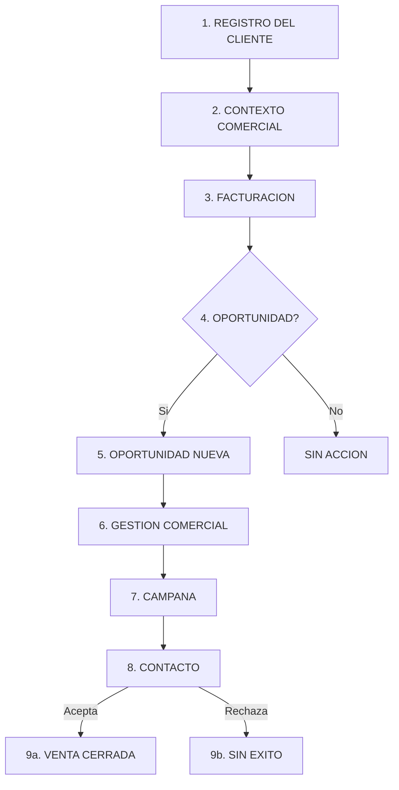

# Informe Ejecutivo: Proyecto Focus (Versión Ampliada)
**TÜV LFD España** 

> ⚠️ **Nota de vigencia (10-06-2026).** Este informe describe la **visión completa** del proyecto (roadmap), no el estado actual. De las tres capacidades "ampliadas" que anuncia, a día de hoy solo el **control de acceso (IAM)** está implementado; las **exclusiones comerciales** y la **gestión de campañas** siguen pospuestas (v2). El motor automático de oportunidades está desactivado — la detección de whitespots es manual desde el Buscador 360. Además, la aplicación incorpora un módulo de **activos inspeccionables** (instalaciones e inspecciones reglamentarias, arrancando por ascensores) no contemplado en este informe. Estado real: ver [`CLAUDE.md`](../../CLAUDE.md) y la documentación de onboarding.

## 1. Resumen Ejecutivo
`Focus` es una iniciativa estratégica para transformar la gestión del cliente en `TÜV LFD España`, pasando de un modelo fragmentado por sistemas y unidades de negocio a una plataforma unificada de dato maestro, análisis comercial y activación de oportunidades.

El proyecto propone consolidar en un único entorno la identidad del cliente, sus relaciones corporativas, contactos, ubicaciones, actividad económica y comportamiento comercial, permitiendo una visión `360` real y accionable.

Esta base habilita una nueva capacidad de negocio: segmentar campañas con mayor precisión, detectar clientes compartidos entre `BUs`, identificar `white spots` y generar oportunidades automáticas de venta cruzada.

En esta versión ampliada, el modelo incorpora tres nuevas capacidades funcionales: un **sistema de incompatibilidades y exclusiones comerciales**, un **modelo de control de acceso a la aplicación** con soporte para Active Directory y usuarios locales, y un **módulo de gestión de campañas comerciales** con trazabilidad completa y prevención de duplicidades.

En términos ejecutivos, `Focus` no debe entenderse como una base de datos más, sino como una plataforma de crecimiento comercial, colaboración entre unidades de negocio y gobierno del dato.

---

## 2. Situación Actual
Actualmente, la información de cliente se encuentra distribuida entre `Business Warehouse`, `CRM`, `SAP` y diferentes ficheros operativos. Esta situación genera varias limitaciones estructurales:

- No existe una visión consolidada del cliente a nivel corporativo.
- La identificación de relaciones entre clientes, holdings y distintas líneas de negocio es incompleta o manual.
- La segmentación comercial depende de trabajo analítico disperso y poco industrializado.
- La trazabilidad sobre contactos, origen del dato y criterios de privacidad no está centralizada.
- El histórico comercial y de facturación no está estructurado de forma homogénea para soportar campañas, renovaciones o detección de oportunidades.
- No existe un control formal sobre qué usuarios pueden acceder a la información comercial ni qué acciones están autorizados a realizar.
- No se dispone de un mecanismo estructurado para registrar incompatibilidades o restricciones comerciales sobre determinados clientes o sectores.

Como consecuencia, la organización pierde capacidad de crecimiento, incrementa el esfuerzo operativo y limita su capacidad para trabajar con una estrategia comercial transversal centrada en el cliente.

---

## 3. Necesidad de Negocio
La evolución del negocio exige una plataforma capaz de responder a preguntas que hoy no se resuelven de manera eficiente:

- Qué relación total mantiene un cliente con `TÜV LFD`.
- Qué clientes trabajan ya con una `BU` pero no con otras.
- Qué grupos empresariales presentan potencial de expansión.
- Qué sectores concentran mejores oportunidades comerciales.
- Qué clientes deben priorizarse por volumen, recurrencia o cercanía de renovación.
- Qué clientes o sectores deben quedar **excluidos** de determinadas acciones comerciales por razones legales, contractuales o estratégicas.
- Quién puede acceder a la plataforma, con qué perfil y sobre qué unidad de negocio.
- Cómo garantizar que una campaña comercial no genere acciones duplicadas sobre el mismo cliente.

`Focus` nace para cubrir esta necesidad, conectando dato maestro, analítica comercial y activación operativa en un único modelo.

---

## 4. Objetivo del Proyecto
El objetivo de `Focus` es construir una plataforma corporativa que permita unificar el dato cliente y convertirlo en una palanca de negocio.

Los objetivos concretos del piloto son:

1. Unificar cada cliente en un `Golden Record` fiable y trazable.
2. Relacionar cliente, holding, `BU`, direcciones, contactos y actividad económica.
3. Consolidar histórico comercial y de facturación para medir actividad, recurrencia y potencial.
4. Habilitar segmentación avanzada para campañas y acciones comerciales.
5. Detectar oportunidades de venta cruzada entre `BUs` a partir de reglas de negocio y patrones de comportamiento.
6. Dar continuidad a la capacidad analítica hoy explotada en `Power BI`, evolucionándola a un modelo corporativo más robusto y escalable.
7. Incorporar un sistema de control de acceso que garantice la seguridad y la trazabilidad de las acciones de los usuarios.
8. Disponer de un mecanismo formal de exclusión e incompatibilidades para proteger la estrategia comercial.
9. Gestionar campañas comerciales de principio a fin con trazabilidad completa.

---

## 5. Propuesta de Solución
La propuesta funcional se apoya en siete bloques complementarios.

### 5.1 Registro Maestro del Cliente
El núcleo del modelo es un `Golden Record` por cliente, consolidado a partir de `CIF/NIF` o identificador fiscal equivalente. Este registro actúa como punto de referencia para todas las relaciones posteriores.

### 5.2 Estructura Relacional de Negocio
El cliente se conecta con:

- `Holdings` o agrupaciones corporativas.
- `Business Units`.
- direcciones y centros operativos.
- contactos.
- actividad económica mediante `CNAE`.

Esto permite entender no solo quién es el cliente, sino también cómo opera, en qué sector se mueve y con qué áreas de `TÜV LFD` ya se relaciona.

### 5.3 Inteligencia Comercial
El modelo incorpora histórico comercial y de facturación, catálogo de servicios y un motor de oportunidades. Esto permite identificar actividad reciente, volumen económico, recurrencia, servicios contratados y señales de expansión comercial.

### 5.4 Activación Comercial
Sobre esa base se habilitan casos de uso concretos para negocio:

- buscador `360` de cliente,
- segmentación para campañas,
- detección de clientes compartidos,
- detección de `white spots`,
- generación de oportunidades de `cross-sell`.

### 5.5 Exclusiones e Incompatibilidades Comerciales
Se incorpora un sistema estructurado para gestionar las **restricciones comerciales** que el negocio necesita aplicar sobre determinados clientes, sectores o unidades de negocio.

**¿Qué problema resuelve?**
En la operativa comercial, existen situaciones en las que un cliente no debe ser contactado para una acción de venta cruzada. Puede ser porque tiene una cláusula contractual que lo impide, porque pertenece a un sector con restricciones regulatorias, o porque la dirección comercial ha decidido no realizar acciones sobre él durante un periodo determinado.

**¿Cómo funciona?**
El sistema permite definir exclusiones a tres niveles:

- **Por cliente específico**: Se bloquea a un cliente concreto, identificado por su registro maestro, para que no sea incluido en ninguna acción comercial mientras la exclusión esté vigente.
- **Por sector económico (CNAE)**: Se bloquea un sector industrial completo. Todos los clientes cuya actividad principal o secundaria corresponda a ese CNAE quedarán fuera de las oportunidades de venta cruzada.
- **Por Unidad de Negocio**: Se pueden establecer restricciones sobre una `BU` completa, impidiendo que se generen oportunidades hacia ella o desde ella durante el periodo definido.

**Vigencia temporal**: Cada exclusión tiene una **fecha de inicio** y una **fecha de fin** opcionales. Esto permite que negocio programe exclusiones temporales (por ejemplo, durante una auditoría externa) sin necesidad de borrar la regla. Si no se indica fecha de fin, la exclusión se considera indefinida hasta que sea desactivada manualmente.

**Tipos de exclusión soportados**:

- `PERMANENT`: Exclusión sin fecha de caducidad, vigente hasta que se desactive.
- `TEMPORARY`: Exclusión con vigencia acotada entre dos fechas.
- `MARKETING_ONLY`: Exclusión que afecta solo a campañas de marketing, permitiendo otro tipo de acciones comerciales directas.

### 5.6 Control de Acceso y Perfiles de Usuario
Se incorpora un modelo de seguridad que establece **quién puede acceder a la aplicación** y **qué acciones está autorizado a realizar** dentro de cada unidad de negocio.

**¿Qué problema resuelve?**
Hasta ahora no existía un mecanismo formal para controlar quién accede a la información comercial del cliente ni para limitar las acciones que puede realizar. El modelo de acceso de `Focus` establece un control granular que protege tanto la integridad del dato como la estrategia comercial.

**Modelo de autenticación dual**:
La aplicación contempla dos vías de acceso para cubrir todas las posibilidades operativas:

- **Usuario de Active Directory (AD)**: Empleados de `TÜV LFD` que acceden con sus credenciales corporativas. El sistema reconoce su identidad a través del nombre de usuario del directorio activo de la compañía.
- **Usuario Local**: Para situaciones en las que un colaborador externo, un consultor o un perfil técnico necesite acceso sin disponer de cuenta AD corporativa. En estos casos, se crea un usuario local con credenciales propias de la aplicación.

**Gestión de usuarios**:
Cada usuario dispone de un indicador de estado (`activo` / `inactivo`) que permite la **baja lógica**: cuando un empleado deja de necesitar acceso, su cuenta se desactiva sin borrar su historial de acciones, garantizando la trazabilidad.

**Sistema de roles y permisos**:
El modelo funciona con tres conceptos relacionados:

- **Roles**: Perfiles funcionales que agrupan capacidades. Ejemplos previstos: `Consulta` (solo lectura), `Comercial` (consulta y gestión de campañas), `Administrador` (acceso completo).
- **Permisos**: Acciones granulares que se asignan a cada rol. Ejemplos: `CAMPAIGN_CREATE`, `DATA_VIEW`, `DATA_ADMIN`, `EXCLUSION_MANAGE`.
- **Ámbito por BU**: Los roles se asignan **siempre vinculados a una Unidad de Negocio**. Esto significa que un usuario puede ser `Administrador` en la BU de `ITV` y `Consulta` en la BU de `Industria`. Si se necesita un perfil global, se le asigna el mismo rol en cada una de las BUs existentes.

Este diseño garantiza que cada unidad de negocio mantiene el control sobre sus datos y que la visibilidad transversal se concede de forma explícita y controlada.

**¿Cómo se accede a la aplicación en la práctica?**

Desde la perspectiva del usuario final, el acceso funciona de la siguiente manera:

- **Si es empleado de `TÜV LFD`**: Abre la aplicación e introduce sus credenciales corporativas (las mismas que usa para el correo o Windows). El sistema valida directamente contra el Active Directory de la compañía. Si la persona está dada de alta en `Focus` y su cuenta está activa, accede con el perfil asignado.
- **Si es colaborador externo**: Accede con un nombre de usuario y contraseña propios de la aplicación, creados por un administrador interno.

En ambos casos, no basta con tener credenciales válidas: un administrador de `Focus` debe haber dado de alta previamente al usuario y haberle asignado rol y unidad de negocio. Esto garantiza que nadie accede sin autorización explícita.

**Nota sobre contraseñas**: El modelo de datos actual no almacena contraseñas. Para usuarios de Active Directory no es necesario, ya que la autenticación la realiza el propio directorio corporativo. Para usuarios locales, la decisión técnica sobre cómo gestionar las credenciales (si se almacenan en la propia base de datos o se delegan a un servicio externo) se tomará en la fase de desarrollo de la aplicación. El modelo está preparado para soportar cualquiera de las opciones sin cambios significativos.

### 5.7 Gestión de Campañas Comerciales
Se incorpora un módulo para crear, gestionar y trazar campañas comerciales desde la plataforma `Focus`, cerrando el ciclo completo desde la detección de la oportunidad hasta la acción comercial.

**¿Qué problema resuelve?**
Actualmente, cuando se detecta una oportunidad de venta cruzada no existe un mecanismo formal para convertirla en una acción comercial coordinada. Tampoco hay forma de saber si un cliente ya ha sido contactado para una propuesta similar, lo que puede derivar en duplicidades, solapamientos o en una experiencia negativa para el cliente.

**¿Cómo funciona?**

1. **Creación de la campaña**: Un usuario autorizado crea una campaña comercial desde la aplicación. El sistema registra automáticamente quién la crea, desde qué `BU` se lanza y en qué fecha. La campaña tiene un ciclo de vida definido: `Borrador` → `Activa` → `Completada` o `Cancelada`.
2. **Asignación de clientes**: Se añaden los clientes objetivo a la campaña, seleccionándolos a partir de oportunidades detectadas, segmentaciones o criterios manuales. El sistema vincula cada cliente con la oportunidad comercial de la que proviene la recomendación.
3. **Prevención de duplicados**: El sistema impide que un mismo cliente sea incluido dos veces en la misma campaña. Si se intenta añadir un cliente que ya existe en esa campaña, el sistema rechaza la operación, evitando llamadas o contactos redundantes.
4. **Seguimiento del contacto**: Cada registro de cliente dentro de la campaña tiene su propio estado de gestión (`Pendiente`, `Contactado`, `Convertido`, `Rechazado`), una fecha de contacto efectivo y un campo de notas para que el comercial registre el resultado de la interacción.
5. **Vinculación con oportunidades**: Cuando un cliente se asigna a una campaña a partir de una oportunidad de venta cruzada, la oportunidad cambia su estado a `EN_CAMPAÑA`, haciendo visible que ese registro ya está siendo gestionado activamente y no debe generar alertas adicionales.

**Catálogo maestro de estados**: Todos los estados mencionados (de oportunidades, campañas, contactos y exclusiones) se encuentran centralizados en una tabla de referencia única del sistema. Esto permite que la aplicación genere desplegables, informes y traducciones a partir de una fuente mantenible, sin necesidad de intervención técnica para añadir o modificar estados.

---

## 6. Flujo Funcional: De la Detección a la Venta

Este apartado describe el recorrido completo de un dato dentro de `Focus`, desde que se registra un cliente hasta que se cierra una venta cruzada. El objetivo es mostrar cómo las capacidades del sistema se encadenan para generar valor comercial real.

### Diagrama del proceso

### Descripción de cada fase

**Fase 1 — Registro del cliente**
Se da de alta al cliente con su identificación fiscal única (CIF/NIF). Si pertenece a un grupo empresarial, se vincula a su holding. El sistema garantiza que no existan dos clientes con el mismo CIF.

**Fase 2 — Contexto comercial**
Se enriquece el perfil del cliente con tres dimensiones: sus **direcciones** (sedes, plantas, almacenes), sus **personas de contacto** (vinculadas a la BU responsable según RGPD) y su **clasificación sectorial** (códigos CNAE que definen su actividad económica).

**Fase 3 — Histórico de facturación**
Se carga la facturación histórica del cliente: qué servicios ha contratado, con qué BU, por qué importe y en qué fechas. Esta información es la base sobre la que el sistema detecta oportunidades.

**Fase 4 — Detección de oportunidades**
El sistema analiza el perfil del cliente (sector, facturación, servicios contratados) y lo compara con la oferta de otras BUs. Si existe potencial de venta cruzada y **no hay ninguna exclusión vigente** que lo impida, se genera una oportunidad.

> *Ejemplo: Un cliente del sector alimentario tiene facturación activa en la BU de Industria (inspecciones de equipos a presión), pero nunca ha contratado con la BU de Certificación. El sistema detecta el potencial y sugiere Certificación ISO 22000 (Seguridad Alimentaria).*

**Fase 5 — Oportunidad generada**
Se crea un registro de oportunidad con toda la trazabilidad: cliente, BU origen, BU destino, servicio sugerido, motivo de la recomendación, prioridad y potencial económico estimado. La oportunidad nace en estado **Nueva**.

**Fase 6 — Gestión comercial**
Un comercial revisa la oportunidad y decide si la acepta. A partir de ahí, la oportunidad avanza por un ciclo de vida definido:

| Estado | Significado |
|:---|:---|
| **Nueva** | Generada automáticamente. Pendiente de revisión. |
| **Aceptada** | El comercial decide trabajarla. |
| **En curso** | Se está preparando una propuesta o contactando al cliente. |
| **En campaña** | Vinculada a una campaña comercial formal. |
| **Cualificada** | El cliente ha mostrado interés real. |
| **Rechazada** | Descartada tras evaluación (no es viable). |
| **Ganada** | Venta materializada con éxito. |
| **Perdida** | El proceso comercial ha concluido sin éxito. |

**Fase 7 — Campaña comercial**
Un responsable comercial crea una campaña para agrupar varias oportunidades y coordinar las acciones de contacto. La campaña también tiene su propio ciclo de vida: `Borrador` → `Activa` → `Completada` o `Cancelada`.

**Fase 8 — Contacto con el cliente**
Se asignan los clientes objetivo a la campaña. El sistema impide duplicados (un cliente no puede estar dos veces en la misma campaña). El comercial utiliza los datos de contacto registrados para realizar la llamada o la visita.

**Fase 9 — Resultado final**

- **9a. Venta cerrada**: El cliente acepta la propuesta. La oportunidad se marca como **Ganada** y el sistema registra la trazabilidad completa: *qué factura generó la señal, qué oportunidad se creó, en qué campaña se gestionó y cuál fue el resultado*.
- **9b. Sin éxito**: El cliente rechaza o no se materializa la venta. La oportunidad se marca como **Perdida** o **Rechazada**, con el motivo documentado.

### Valor de la trazabilidad

La gran ventaja de este flujo es que permite responder a preguntas clave para dirección:

- *¿Cuántas oportunidades ha generado la BU de Industria para la BU de Certificación este trimestre?*
- *¿Cuál ha sido la tasa de conversión de la última campaña?*
- *¿Cuánto tiempo pasó desde la detección de la oportunidad hasta el cierre de la venta?*
- *¿Qué volumen de negocio ha generado el cross-sell en el último año?*

---

## 7. Capacidades Clave para Dirección
`Focus` aporta capacidades diferenciales de alto valor para dirección:

### 7.1 Visión 360 del Cliente
Permite conocer de forma consolidada la relación total de un cliente con `TÜV LFD`, independientemente de la `BU` con la que opere.

### 7.2 Segmentación Comercial Avanzada
Permite construir audiencias y campañas combinando filtros por:

- `BU`,
- geografía,
- holding,
- servicios contratados,
- volumen de facturación,
- recurrencia,
- actividad económica `CNAE`.

### 7.3 Clasificación Sectorial por CNAE
La incorporación de `CNAE` añade una dimensión estratégica para entender el perfil sectorial del cliente y lanzar campañas específicas por industria.

### 7.4 Detección de White Spots
Permite identificar clientes relevantes que ya trabajan con una línea de negocio pero todavía no tienen presencia en otras `BUs` donde existe potencial comercial.

### 7.5 Venta Cruzada Automática
Permite detectar oportunidades a partir de reglas basadas en comportamiento histórico, sector, recurrencia, proximidad de renovación o comparación con clientes similares.

### 7.6 Control de Exclusiones Comerciales
Permite a la dirección comercial establecer reglas formales de protección sobre clientes, sectores o BUs completas, temporales o permanentes, que el sistema respeta de forma automática al generar oportunidades y campañas.

### 7.7 Seguridad y Control de Acceso
Garantiza que solo las personas autorizadas acceden a la información comercial, con permisos específicos por unidad de negocio y trazabilidad completa de las acciones realizadas.

### 7.8 Gestión de Campañas con Trazabilidad
Ofrece a dirección la capacidad de conocer qué campañas se han lanzado, desde qué `BU`, quién las ha creado, a cuántos clientes se ha contactado, con qué resultado y sin duplicidades.

### 7.9 Gobierno y Trazabilidad
Refuerza el control sobre el dato mediante trazabilidad de origen, referencias técnicas de carga y definición de ownership sobre contactos y relaciones de negocio.

---

## 8. Evolución del Modelo de Información
El diseño funcional y técnico actualizado incorpora mejoras relevantes respecto al planteamiento inicial.

### 8.1 Dimensión CNAE
Se incorpora una tabla maestra de `CNAE` y una relación entre clientes y `CNAEs`, permitiendo asignar actividad principal y actividades secundarias cuando aplique.

### 8.2 Enriquecimiento del Histórico Comercial
`Billing Records` amplía su alcance con nuevos atributos de negocio:

- `invoice_amount`,
- `invoice_date`,
- `invoice_description`.

Esto permite pasar de un histórico básico a una base de análisis comercial con mayor valor para campañas, priorización y reporting.

### 8.3 Oportunidades con Contexto Comercial
Las oportunidades de `cross-sell` incluyen mayor información para su gestión:

- `BU` origen,
- `BU` objetivo,
- servicio sugerido,
- motivo de la recomendación,
- prioridad,
- potencial económico.

### 8.4 Exclusiones e Incompatibilidades
El modelo incorpora la capacidad de definir reglas de exclusión comercial con vigencia temporal controlable, aplicables a nivel de cliente, sector `CNAE` o unidad de negocio. Las exclusiones permiten bajas lógicas gestionadas por fechas para que negocio pueda activar o desactivar restricciones sin perder el histórico.

### 8.5 Identidad y Control de Acceso
Se incorpora un sistema completo de gestión de usuarios, roles y permisos, con soporte dual para `Active Directory` y usuarios locales. Los roles se asignan siempre en el contexto de una unidad de negocio, lo que garantiza una segregación funcional alineada con la estructura organizativa de `TÜV LFD`.

### 8.6 Campañas Comerciales
El modelo cierra el ciclo de activación comercial con tablas dedicadas a la creación y seguimiento de campañas, incluyendo la asignación de clientes objetivo, la vinculación con oportunidades de venta cruzada y la prevención automática de duplicidades.

### 8.7 Catálogo Maestro de Estados
Se incorpora una tabla de referencia centralizada que recoge todos los estados y tipos de datos válidos del sistema (estados de oportunidades, campañas, contactos y exclusiones). Esto permite a la aplicación generar desplegables, informes y traducciones a partir de una fuente única, mantenible y extensible sin intervención técnica.

**Decisión de diseño**: La relación entre `STATUS_CATALOG` y las tablas operativas es **lógica, no física**. Los campos de estado (`status`, `exclusion_type`) se validan mediante `CHECK` constraints a nivel de base de datos, no mediante Foreign Keys. Esta decisión garantiza legibilidad directa en las consultas SQL y evita JOINs innecesarios, mientras que `STATUS_CATALOG` proporciona los metadatos (nombre legible, descripción, orden de presentación) para la capa de aplicación.

---

## 9. Casos de Uso Prioritarios
Los principales casos de uso previstos para el piloto son los siguientes.

### 9.1 Lanzamiento de Campañas
Un responsable de negocio podrá construir segmentos de clientes usando filtros comerciales y sectoriales, obteniendo listas de trabajo accionables y con contexto suficiente para la actividad comercial. Las campañas se registrarán en la plataforma con trazabilidad completa de quién las creó, desde qué `BU` y con qué clientes objetivo.

### 9.2 Detección de Oportunidades Automáticas
El sistema podrá identificar clientes con actividad reciente en una `BU` y alto potencial de contratación en otra, generando oportunidades priorizadas de venta cruzada. El sistema validará previamente que el cliente no esté sujeto a una exclusión vigente.

### 9.3 Identificación de White Spots
Se podrán detectar clientes estratégicos con baja penetración de servicios, apoyando planes de crecimiento transversal por `BU` o familia de servicio.

### 9.4 Segmentación por Sector
La dimensión `CNAE` permitirá campañas específicas para determinados sectores, mejorando precisión, relevancia y especialización comercial.

### 9.5 Gestión de Exclusiones por Negocio
Un administrador de `BU` podrá registrar exclusiones para clientes o sectores específicos, estableciendo el motivo, la fecha de inicio y, opcionalmente, la fecha de fin. Las exclusiones se tendrán en cuenta automáticamente en la generación de oportunidades y en la asignación de clientes a campañas.

### 9.6 Alta y Gestión de Usuarios
Un administrador podrá dar de alta usuarios en la aplicación, asignarles roles y permisos por `BU`, y gestionar bajas lógicas sin pérdida de trazabilidad.

---

## 10. Beneficios Esperados
La implantación de `Focus` debe generar beneficios claros en términos de negocio y gestión:

- incremento del potencial de venta cruzada entre unidades de negocio,
- mayor eficiencia comercial gracias a campañas más precisas,
- mejor capacidad para identificar clientes estratégicos y holdings,
- reducción del trabajo manual de consolidación y explotación,
- mejora de la calidad, trazabilidad y gobierno del dato,
- base sólida para reporting y toma de decisiones por parte de dirección,
- prevención de duplicidades y solapamientos en acciones comerciales,
- protección de restricciones comerciales mediante exclusiones formalizadas,
- control de acceso seguro y auditable sobre la información comercial.

---

## 11. Alcance Recomendado del Piloto
Para maximizar valor y controlar riesgo, el piloto debería centrarse en:

1. consolidación inicial del `Golden Record` a partir de las fuentes ya identificadas,
2. despliegue del nuevo modelo de datos maestro y comercial,
3. segmentación inicial por `BU`, geografía, facturación y `CNAE`,
4. configuración de reglas iniciales de `white spots` y `cross-sell`,
5. activación del sistema de exclusiones con las reglas básicas definidas por negocio,
6. alta de usuarios del piloto con roles y permisos por `BU`,
7. registro de las primeras campañas comerciales para validar el flujo completo,
8. entrega de primeras salidas ejecutivas y comerciales para validación con negocio.

Este enfoque permite demostrar valor tangible sin asumir desde el inicio un alcance excesivo.

---

## 12. Riesgos y Factores de Éxito
El éxito del proyecto dependerá de gestionar adecuadamente varios factores clave:

### Riesgos
- calidad y homogeneidad de los datos de origen,
- necesidad de reglas claras de deduplicación y priorización,
- definición de privacidad y ownership del dato de contacto,
- adopción real por parte de negocio,
- riesgo de ampliar alcance antes de validar el piloto,
- necesidad de definir con dirección los roles y permisos iniciales,
- riesgo de exclusiones desactualizadas si no se establece un procedimiento claro de revisión periódica.

### Factores de Éxito
- alineamiento claro con dirección comercial y negocio,
- priorización de casos de uso concretos,
- modelo de datos robusto pero pragmático,
- gobierno del dato desde el inicio,
- foco en entregables con valor visible para dirección,
- definición temprana de los perfiles de usuario y los responsables de cada `BU`,
- formación básica a usuarios clave sobre la gestión de campañas y exclusiones.

---

## 13. Próximos Pasos Recomendados
Se recomienda avanzar en la siguiente secuencia:

1. Validar con dirección el alcance del piloto y los casos de uso prioritarios.
2. Confirmar fuentes iniciales y reglas maestras de consolidación.
3. Definir los perfiles de usuario, roles y permisos iniciales para el piloto.
4. Establecer las exclusiones comerciales vigentes conocidas por negocio.
5. Ejecutar una primera carga piloto sobre el nuevo esquema de base de datos.
6. Definir indicadores de éxito del piloto.
7. Preparar una demostración ejecutiva centrada en segmentación, `white spots`, oportunidades de venta cruzada y gestión de campañas.

---

## 14. Conclusión
`Focus` ofrece a `TÜV LFD` la oportunidad de evolucionar desde un entorno fragmentado de información hacia una plataforma corporativa centrada en el cliente, capaz de combinar conocimiento, control y crecimiento comercial.

La versión ampliada del modelo refuerza esta visión con tres capacidades adicionales que responden a necesidades reales del negocio: un **sistema formal de exclusiones** que protege la estrategia comercial, un **control de acceso por perfiles y unidades de negocio** que garantiza la seguridad del dato, y un **módulo de campañas** que conecta la detección de oportunidades con la activación comercial de forma trazable y controlada.

La relevancia del proyecto no reside únicamente en ordenar el dato, sino en convertirlo en una ventaja competitiva: mejor segmentación, mayor capacidad de `cross-sell`, visión compartida entre `BUs`, protección del dato, control del acceso y mejor soporte a la toma de decisiones de dirección.

En este sentido, `Focus` debe considerarse una iniciativa estratégica de negocio apoyada en datos, y no únicamente un esfuerzo técnico de integración.
